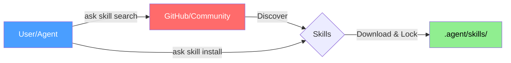

# ASK: The Ultimate Agent Skills Kit

<p align="center">
  
</p>

<p align="center">
  <strong>The Missing Package Manager for Agent Skills</strong>
</p>

<p align="center">
  Just ask, the agents are ready!
</p>

<p align="center">
  <a href="https://github.com/yeasy/ask/releases"></a>
  <a href="https://github.com/yeasy/ask/blob/main/LICENSE"></a>
  <a href="https://github.com/yeasy/ask/stargazers"></a>
  <a href="https://goreportcard.com/report/github.com/yeasy/ask"></a>
  
</p>

<p align="center">
  <a href="README.md">English</a> | <a href="README_zh.md">中文</a>
</p>

---

<p align="center">
  <a href="#-quick-start">🚀 Quick Start</a> •
  <a href="#-key-features">✨ Features</a> •
  <a href="#-commands">📋 Commands</a> •
  <a href="docs/README.md">📚 Documentation</a>
</p>

---

**ASK** (Agent Skills Kit) is the package manager for AI Agent skills. Just like `brew` manages macOS packages, `pip` manages Python packages, or `npm` manages Node.js dependencies, `ask` helps you discover, install, and lock skills for your agents (Claude, Cursor, Codex, etc.).




## ✨ Key Features

| Feature | Description |
| :--- | :--- |
| **📦 Smart Management** | Install, update, and remove skills with ease. Includes `ask.lock` for reproducible builds. |
| **🔍 Multi-Source** | Unified search across GitHub and official repos (Anthropic, OpenAI, etc.). You can add more skill sources. |
| **🤖 Multi-Agent** | Auto-detects and installs for **Claude** (`.claude/`), **Cursor** (`.cursor/`), **Codex** (`.codex/`), and more. |
| **⚡ Blazing Fast** | Written in Go. Parallel downloads, sparse checkouts, and zero runtime dependencies. |
| **🔌 Offline Mode** | Full offline support with `--offline`. Perfect for air-gapped or secure environments. |
| **🌍 Global & Local** | Manage project-specific skills (`.agent/skills`) or user-wide tools (`~/.ask/skills`). |

## 🚀 Quick Start

### 1. Install

**Homebrew (macOS/Linux):**
```bash
brew tap yeasy/ask
brew install ask
```

**Go Install:**
```bash
go install github.com/yeasy/ask@latest
```

### 2. Initialize
Enter your project directory and run:
```bash
ask init
```
This creates an `ask.yaml` configuration file.

### 3. Use

```bash
# Search for skills
ask search mcp

# Install a skill (by name or repo, `ask add` is an alias for `ask install`)
ask install mcp-builder
ask install superpowers

# Install specific version
ask install mcp-builder@v1.0.0

# Install for specific agent
ask install mcp-builder --agent claude
```

## 📋 Commands

### Skill Management
| Command | Description |
| :--- | :--- |
| `ask skill search <keyword>` | Search across all sources |
| `ask skill install <name>` | Install skill(s) |
| `ask skill list` | List installed skills |
| `ask skill uninstall <name>` | Remove a skill |
| `ask skill update` | Update skills to latest version |
| `ask skill outdated` | Check for newer versions |

### Repository Management
| Command | Description |
| :--- | :--- |
| `ask repo list` | Show configured repositories |
| `ask repo add <url>` | Add a custom skill source |
| `ask repo sync` | Clone/update repos to local cache |

## 🌐 Skill Sources

ASK comes pre-configured with trusted sources:

| Source | Description |
| :--- | :--- |
| **Anthropic** | Official [anthropics/skills](https://github.com/anthropics/skills) |
| **Community** | Top-rated community skills (GitHub `agent-skill` and `agent-skills` topics) |
| **Composio** | [ComposioHQ/awesome-claude-skills](https://github.com/ComposioHQ/awesome-claude-skills) collection |
| **OpenAI** | Official [openai/skills](https://github.com/openai/skills) |
| **Vercel** | [vercel-labs/agent-skills](https://github.com/vercel-labs/agent-skills) AI SDK skills |

### Optional Repositories

For specific needs, you can add these additional sources:

| Repository | Command to Add | Description |
| :--- | :--- | :--- |
| **SkillHub** | `ask repo add skillhub/skills` | [SkillHub.club](https://www.skillhub.club) index |
| **Scientific** | `ask repo add K-Dense-AI/claude-scientific-skills` | Data science & research skills |
| **MATLAB** | `ask repo add matlab/skills` | Official MATLAB integration |
| **Superpowers** | `ask repo add obra/superpowers` | Full dev workflow with sub-agents |
| **Planning** | `ask repo add OthmanAdi/planning-with-files` | File-based persistent planning |
| **UI/UX Pro** | `ask repo add nextlevelbuilder/ui-ux-pro-max-skill` | 57 UI styles, 95 color schemes |
| **NotebookLM** | `ask repo add PleasePrompto/notebooklm-skill` | Auto-upload to NotebookLM |
| **AI DrawIO** | `ask repo add GBSOSS/ai-drawio` | Flowchart & diagram generation |
| **PPT Skills** | `ask repo add op7418/NanoBanana-PPT-Skills` | Dynamic PPT generation |

## 📂 Installation Layout

Default structure after installation:
```text
my-project/
├── ask.yaml          # Project config
├── ask.lock          # Lockfile (commit hashes)
└── .agent/           
    └── skills/       # Default install location
        ├── mcp-builder/
        └── writing-plans/
```

**Agent-Specific Paths:**
- **Claude**: `.claude/skills/`
- **Cursor**: `.cursor/skills/`
- **Codex**: `.codex/skills/`

## 🤝 Contributing
Contributions are welcome! See [CONTRIBUTING.md](CONTRIBUTING.md) for details.

## 📄 License
MIT License. See [LICENSE](LICENSE) for details.
