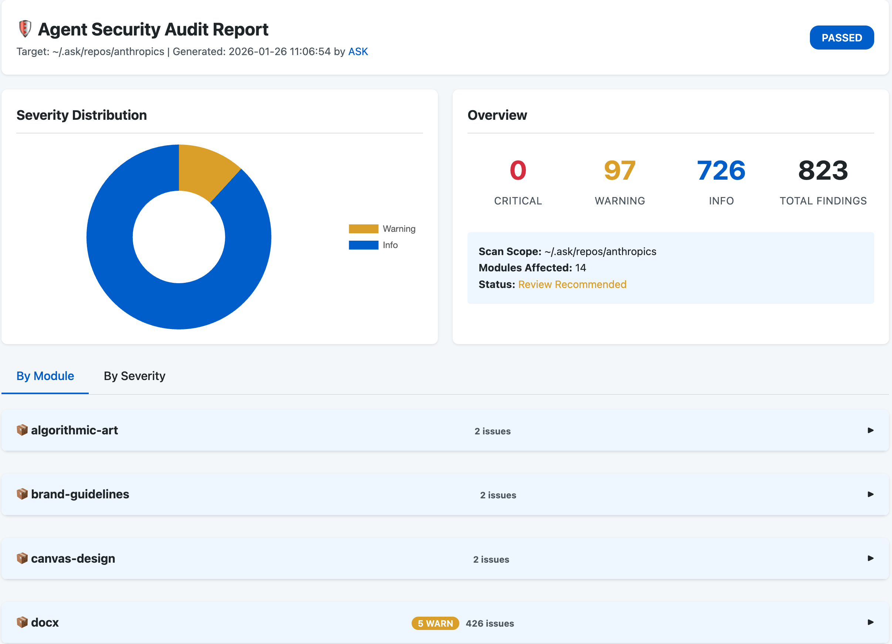
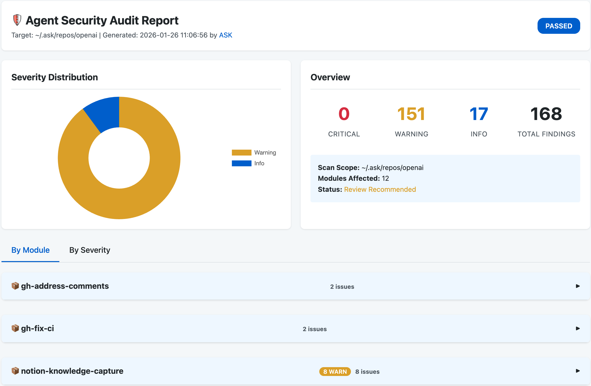
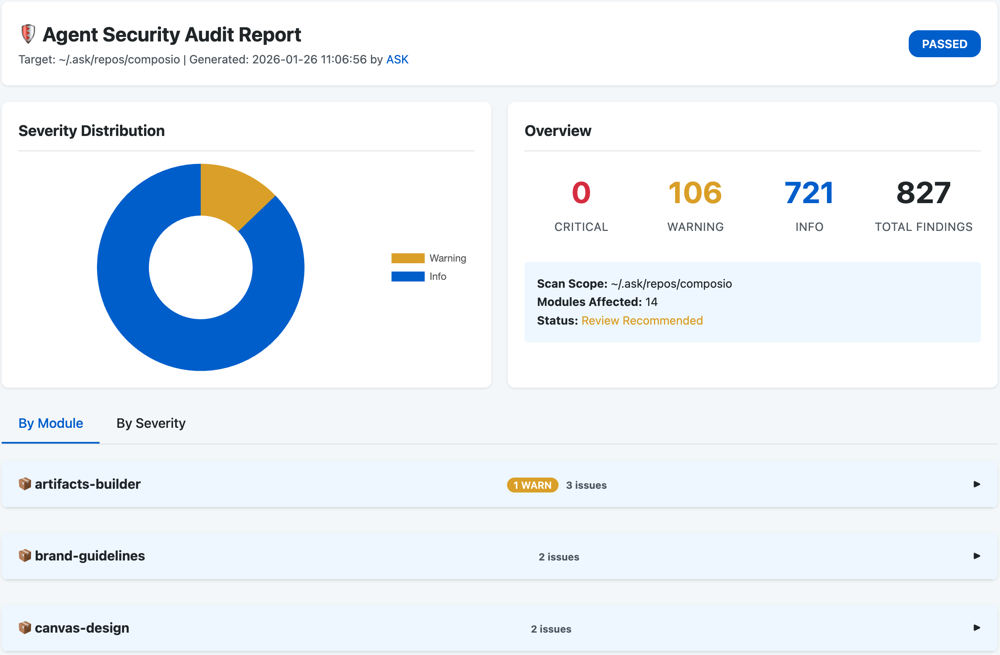
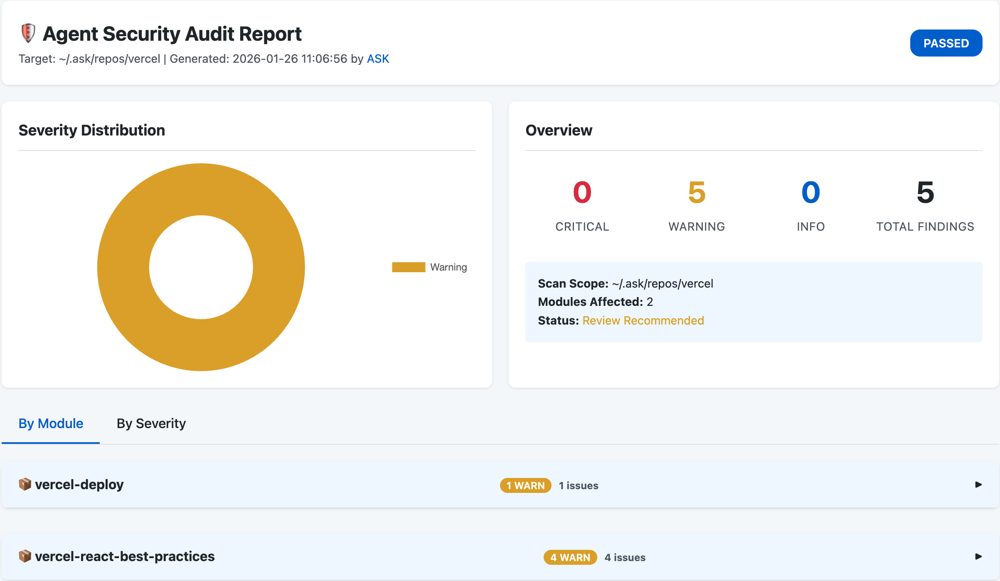

# ASK: Agent Skills Kit

<p align="center">
  
</p>

<p align="center">
  <strong>智能体必备的技能包管理器</strong>
</p>

<p align="center">
  只需一行命令，让智能体掌握无限可能。
</p>

<p align="center">
  <a href="https://github.com/yeasy/ask/releases"></a>
  <a href="https://github.com/yeasy/ask/blob/main/LICENSE"></a>
  <a href="https://github.com/yeasy/ask/stargazers"></a>
  
</p>

<p align="center">
  <a href="README.md">English</a> | <a href="README_zh.md">中文</a>
</p>

---

<p align="center">
  <a href="#-快速开始">🚀 快速开始</a> •
  <a href="#-核心特性">✨ 核心特性</a> •
  <a href="#-常用命令">📋 常用命令</a> •
  <a href="docs/README.md">📚 文档</a>
</p>

---

**ASK** (Agent Skills Kit) 是专为 AI Agent 设计的技能包管理器。就像 `brew` 管理 macOS 软件、`pip` 管理 Python 包一样，`ask` 帮助您高效发现、安装和管理 AI 智能体的各种能力（支持 Claude, Cursor, Codex 等）。


## ✨ 核心特性

| 特性 | 说明 |
| :--- | :--- |
| **📦 智能管理** | 轻松安装、升级和卸载。支持 `ask.lock` 版本锁定，确保环境一致性。 |
| **🔍 多源聚合** | 统一检索 GitHub 社区及官方仓库 (Anthropic, OpenAI 等)。支持添加更多自定义源。 |
| **🤖 Agent 无关** | 适用于 **任何** AI 智能体。自动适配 **Claude**, **Cursor**, **Codex**，并支持自定义 Agent 配置，不绑定特定厂商。 |
| **⚡ 极速体验** | 纯 Go 语言编写。支持并发下载、稀疏检出 (Sparse Checkout)，无运行时依赖，毫秒级响应。 |
| **🔌 离线模式** | 支持 `--offline` 离线模式，优先使用本地缓存，完美适配内网或安全受限环境。 |
| **🌎 全局与本地** | 灵活支持项目级 (`.agent/skills`) 和用户级 (`~/.ask/skills`) 隔离管理。 |
| **🛡️ 安全守卫** | 内置安全扫描引擎，通过熵值分析检测敏感信息泄漏、危险命令及恶意代码，为智能体保驾护航。 |

## 🚀 快速开始

### 1. 安装

**Homebrew (macOS/Linux):**
```bash
brew tap yeasy/ask
brew install ask
```

**源码安装:**
```bash
git clone https://github.com/yeasy/ask.git
cd ask
make build && mv ask /usr/local/bin/
```

### 2. 初始化
进入项目目录并运行：
```bash
ask init
```
这将创建一个 `ask.yaml` 配置文件。

### 3. 使用
```bash
# 搜索 Skill
ask search mcp

# 安装 Skill (通过名称或仓库，支持使用 ask add 别名)
ask install anthropics/mcp-builder
ask add superpowers

# 安装指定版本
ask install mcp-builder@v1.0.0

# 为指定 Agent 安装
ask install mcp-builder --agent claude

# 安全检查
ask check .
ask check anthropics/mcp-builder -o report.html
```

## 📋 命令参考

### Skill 管理
| 命令 | 说明 |
| :--- | :--- |
| `ask search <keyword>` | 在所有源中搜索 |
| `ask install <name>` | 安装 Skill (别名: `add`, `i`) |
| `ask list` | 列出已安装的 Skill |
| `ask uninstall <name>` | 卸载 Skill |
| `ask update` | 更新 Skill 到最新版本 |
| `ask outdated` | 检查可用更新 |
| `ask check <path>` | 安全扫描 (密钥泄漏, 危险命令等) |

### 仓库管理
| 命令 | 说明 |
| :--- | :--- |
| `ask repo list` | 显示已配置的仓库 |
| `ask repo add <url>` | 添加自定义 Skill 源 |
| `ask repo sync` | 同步仓库到本地缓存 |

## 🌐 技能来源

ASK 默认内置了以下受信源：

| 来源 | 说明 |
| :--- | :--- |
| **Anthropic** | 官方库 [anthropics/skills](https://github.com/anthropics/skills) |
| **Community** | GitHub 社区高分技能 (`agent-skill` 和 `agent-skills` topics) |
| **Composio** | 精选集 [ComposioHQ/awesome-claude-skills](https://github.com/ComposioHQ/awesome-claude-skills) |
| **OpenAI** | 官方库 [openai/skills](https://github.com/openai/skills) |
| **Vercel** | AI SDK [vercel-labs/agent-skills](https://github.com/vercel-labs/agent-skills) |

### 可选技能仓库

如有特定需求，您可以添加以下额外来源：

| 仓库 | 添加命令 | 说明 |
| :--- | :--- | :--- |
| **Scientific** | `ask repo add K-Dense-AI/claude-scientific-skills` | 数据科学与研究技能 |
| **MATLAB** | `ask repo add matlab/skills` | 官方 MATLAB 集成 |
| **Superpowers** | `ask repo add obra/superpowers` | 全链路开发工作流 |
| **Planning** | `ask repo add OthmanAdi/planning-with-files` | 文件持久化规划 |
| **UI/UX Pro** | `ask repo add nextlevelbuilder/ui-ux-pro-max-skill` | 57种UI风格，95种配色 |
| **NotebookLM** | `ask repo add PleasePrompto/notebooklm-skill` | 自动上传到NotebookLM |
| **AI DrawIO** | `ask repo add GBSOSS/ai-drawio` | 流程图自动生成 |
| **PPT Skills** | `ask repo add op7418/NanoBanana-PPT-Skills` | 动态PPT生成 |

## 📊 安全审计报告






完整安全审计报告：

- [🛡️ Anthropic 安全审计报告](reports/anthropics.html)
- [🛡️ OpenAI 安全审计报告](reports/openai.html)
- [🛡️ Composio 安全审计报告](reports/composio.html)
- [🛡️ Vercel 安全审计报告](reports/vercel.html)

## 📂 目录结构

安装后的默认结构：
```text
my-project/
├── ask.yaml          # 项目配置
├── ask.lock          # 版本锁定文件
└── .agent/           
    └── skills/       # 默认技能目录
        ├── mcp-builder/
        └── writing-plans/
```

**不同 Agent 会自动探索对应安装路径:**
- **Claude**: `.claude/skills/`
- **Cursor**: `.cursor/skills/`
- **Codex**: `.codex/skills/`

## 🐞 调试

要查看详细的操作日志（如扫描、更新、搜索），请设置 `ASK_LOG=debug`：

```bash
export ASK_LOG=debug
ask skill install browser-use
```

## 🤝 贡献参与
欢迎提交 PR 或 Issue！详见 [CONTRIBUTING.md](CONTRIBUTING.md)。

## 📄 许可证
MIT License. 详见 [LICENSE](LICENSE) 文件。
