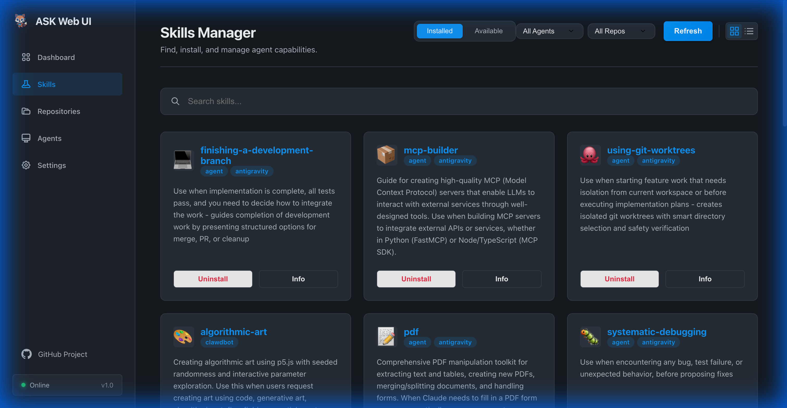
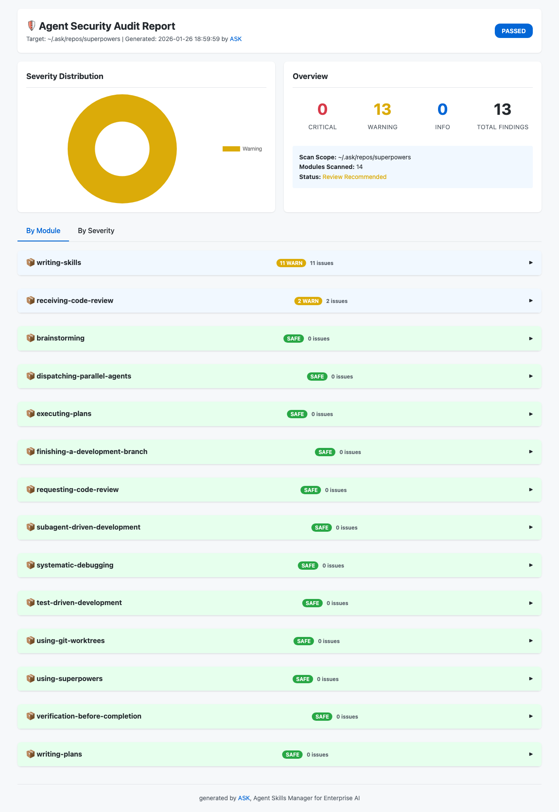

# ASK: Agent Skills Kit

<p align="center">
  
</p>

<h3 align="center">一条命令，所有智能体。</h3>

<p align="center">
  安装一次 — 自动同步到 Claude、Cursor、Codex、Copilot、Windsurf、Gemini、Hermes、OpenClaw 等 20 个智能体。
</p>

<p align="center">
  <a href="https://github.com/yeasy/ask/releases"></a>
  <a href="https://github.com/yeasy/ask/blob/main/LICENSE"></a>
  <a href="https://github.com/yeasy/ask/stargazers"></a>
  <a href="https://goreportcard.com/report/github.com/yeasy/ask"></a>
  
</p>

<p align="center">
  <a href="README.md">English</a> | <a href="README_zh.md">中文</a>
</p>

---

<p align="center">
  <a href="#-为什么选择-ask">💡 为什么选择 ASK</a> •
  <a href="#-快速开始">🚀 快速开始</a> •
  <a href="#-核心特性">✨ 核心特性</a> •
  <a href="#-命令参考">📋 命令参考</a> •
  <a href="docs/README_zh.md">📚 文档</a>
</p>

---

## 💡 为什么选择 ASK

你在 Claude 上找到一个好用的 Skill，但你也用 Cursor。
你在 Cursor 上配置了规则，但团队有人用 Copilot。
你想审计第三方技能，但没有标准工具。

**ASK 解决这个问题。** 一次安装，所有智能体同步 — 自带版本锁定、安全扫描和离线支持。

```
$ ask install browser-use
✓ Installed browser-use
  Synced to: Claude   (.claude/skills/)
             Cursor   (.cursor/skills/)
             Codex    (.codex/skills/)
```

## ✨ 核心特性

| 特性 | 说明 |
| :--- | :--- |
| **🤖 20 个智能体，一个 CLI** | 一次安装，自动同步到 Claude、Cursor、Codex、Copilot、Windsurf、Gemini CLI、Hermes、OpenClaw 等 20 个智能体。不绑定厂商。 |
| **📦 版本锁定** | `ask.lock` 精确锁定 commit，确保可复现构建。`ask lock-install` 类似 `npm ci`，专为 CI/CD 设计。 |
| **🛡️ 安全扫描** | 15+ 条内置规则检测密钥泄漏、危险命令和恶意代码。支持 SARIF 格式输出，集成 GitHub Code Scanning。 |
| **🔍 精选注册表** | 搜索 [官方注册表](https://github.com/yeasy/awesome-agent-skills)、GitHub 仓库和社区源。 |
| **⚡ 极速体验** | 纯 Go 编写，并发下载、稀疏检出，零运行时依赖。 |
| **🔌 离线与企业** | 完整离线模式、私有仓库支持、来源白名单、HTML 审计报告。 |
| **🌎 全局与本地** | 项目级 (`.agent/skills`) 和用户级 (`~/.ask/skills`) 隔离管理。 |
| **🖥️ 桌面与 Web** | 精美 UI，支持 `ask serve` Web 服务器或 [Wails](https://wails.io) 原生桌面应用。 |

## 🖥️ Web UI & 桌面应用

<p align="center">
  
</p>

ASK 提供精美的 Web 界面进行技能发现和管理 — 支持 **Web 服务器** (`ask serve`) 和 **原生桌面应用**。

| 功能 | 说明 |
| :--- | :--- |
| **📊 仪表盘** | 总览已安装技能、仓库和系统状态 |
| **🔍 技能浏览器** | 搜索、筛选并一键安装技能 |
| **📦 仓库管理** | 从 GitHub 添加并同步技能源 |
| **🛡️ 安全审计** | 查看生成的安全报告 |

### 启动
```bash
# Web 服务器
ask serve

# 桌面应用 (需要 Wails CLI)
wails build && ./build/bin/ask-desktop
```

📖 [Web UI 文档 →](docs/web-ui_zh.md)

## 🚀 快速开始

### 1. 安装

**Homebrew (macOS/Linux):**
```bash
brew tap yeasy/tap
brew install yeasy/tap/ask              # 命令行版本
brew install --cask yeasy/tap/ask-desktop  # 桌面应用 (仅 macOS)
```

> [!NOTE]
> **macOS 用户请注意**：首次打开 `ask-desktop` 时若提示"无法验证开发者"，请前往 **系统设置 > 隐私与安全性**，在"安全性"区域点击 **"仍要打开" (Open Anyway)** 即可正常运行。

**Go Install:**
```bash
go install github.com/yeasy/ask@latest
```

**源码安装:**
```bash
git clone https://github.com/yeasy/ask.git
cd ask
make build && mv ask /usr/local/bin/
make build-desktop # 构建桌面应用
```

**二进制 / 手动安装 (Windows / Linux / Desktop):**
请前往 [Releases](https://github.com/yeasy/ask/releases) 页面下载对应系统的预编译二进制文件或桌面应用。


### 2. 初始化
进入项目目录并运行：
```bash
ask init
```
这将创建一个 `ask.yaml` 配置文件。

### 3. 使用
```bash
# 搜索 Skill
ask search mcp

# 安装 Skill (通过名称或仓库，`ask add` 是 `ask install` 的别名)
ask install anthropics/mcp-builder
ask install superpowers

# 安装根目录类型的 Skill (如 Youtube Clipper)
ask install op7418/Youtube-clipper-skill

# 安装指定版本
ask install mcp-builder@v1.0.0

# 为指定 Agent 安装
ask install mcp-builder --agent claude
ask install mcp-builder --agent hermes
ask install mcp-builder --agent claude,cursor

# 安全检查
ask check .
ask check anthropics/mcp-builder -o report.html

# 从 ask.lock 或 ask.yaml 还原安装技能（不带参数运行）
ask install

# 启动 Web 管理界面
ask serve

# 从指定仓库安装技能
ask skill install --repo anthropics pdf
# 安装指定仓库下的所有技能
ask skill install --repo anthropics
```

### Hermes 说明

Hermes 默认加载 `$HERMES_HOME/skills`（通常是 `~/.hermes/skills`）。ASK 全局安装（`--agent hermes --global`）会使用该目录；项目本地安装会写入 `.hermes/skills`，如需 Hermes 自动加载，请在 Hermes 配置中将该项目绝对路径加入 `skills.external_dirs`。

## 📋 命令参考

### Skill 管理
| 命令 | 说明 |
| :--- | :--- |
| `ask skill search <keyword>` | 在所有源中搜索 |
| `ask skill install <name>` | 安装 Skill (别名: `add`, `i`) |
| `ask skill list` | 列出已安装的 Skill |
| `ask skill uninstall <name>` | 卸载 Skill |
| `ask skill update` | 更新 Skill 到最新版本 |
| `ask skill outdated` | 检查可用更新 |
| `ask skill info <name>` | 显示 Skill 详细信息 |
| `ask skill check <path>` | 安全扫描 + SKILL.md 格式验证 |
| `ask skill score <path>` | 计算 Skill 信任评分 |
| `ask skill test <path>` | 运行 Skill 验证检查 |
| `ask skill prompt [paths]` | 生成 XML 格式供 Agent 系统提示使用 |
| `ask skill create <name>` | 从模板创建新 Skill |
| `ask skill publish <path>` | 验证并准备发布 Skill |

### 仓库管理
| 命令 | 说明 |
| :--- | :--- |
| `ask repo list` | 显示已配置的仓库 |
| `ask repo add <url>` | 添加自定义 Skill 源 (添加后可使用 `--sync` 或手动运行 `ask repo sync` 下载) |
| `ask repo remove <name>` | 移除仓库 |
| `ask repo sync` | 同步仓库到本地缓存 (`~/.ask/repos`) |

### 系统命令
| 命令 | 说明 |
| :--- | :--- |
| `ask doctor` | 诊断并报告 ASK 健康状态（配置、技能、缓存、系统） |
| `ask serve` | 启动 Web 管理界面 |
| `ask audit` | 生成已安装 Skill 的安全审计报告 |
| `ask lock-install` | 从 `ask.lock` 安装精确版本（类似 `npm ci`） |
| `ask init` | 初始化 ASK 项目配置 |
| `ask benchmark` | 运行已配置仓库的性能基准测试 |
| `ask quickstart` | 安装推荐技能包 |
| `ask version` | 显示当前版本 |

## 🌐 技能来源

ASK 默认内置了以下受信源：

| 来源 | 说明 |
| :--- | :--- |
| **Featured** | 精选注册表 [yeasy/awesome-agent-skills](https://github.com/yeasy/awesome-agent-skills) |
| **Anthropic** | 官方库 [anthropics/skills](https://github.com/anthropics/skills) |
| **Composio** | 精选集 [ComposioHQ/awesome-claude-skills](https://github.com/ComposioHQ/awesome-claude-skills) |
| **OpenAI** | 官方库 [openai/skills](https://github.com/openai/skills) |
| **Vercel** | AI SDK [vercel-labs/agent-skills](https://github.com/vercel-labs/agent-skills) |
| **OpenClaw** | [openclaw/openclaw](https://github.com/openclaw/openclaw/tree/main/skills) OpenClaw 内置技能 |

### 可选技能仓库

如有特定需求，您可以添加以下额外来源：

| 仓库 | 添加命令 | 说明 |
| :--- | :--- | :--- |
| **Community** | `ask repo add yeasy/awesome-agent-skills` | GitHub 社区高分技能 (`agent-skill` topics) |
| **Scientific** | `ask repo add K-Dense-AI/claude-scientific-skills` | 数据科学与研究技能 |
| **MATLAB** | `ask repo add matlab/skills` | 官方 MATLAB 集成 |
| **Superpowers** | `ask repo add obra/superpowers` | 全链路开发工作流 |
| **Planning** | `ask repo add OthmanAdi/planning-with-files` | 文件持久化规划 |
| **UI/UX Pro** | `ask repo add nextlevelbuilder/ui-ux-pro-max-skill` | 57种UI风格，95种配色 |
| **NotebookLM** | `ask repo add PleasePrompto/notebooklm-skill` | 自动上传到NotebookLM |
| **AI DrawIO** | `ask repo add GBSOSS/ai-drawio` | 流程图自动生成 |
| **PPT Skills** | `ask repo add op7418/NanoBanana-PPT-Skills` | 动态PPT生成 |
| **Antigravity** | `ask repo add sickn33/antigravity-awesome-skills` | 600+ 个 Claude Code & Cursor 智能体技能合集 |


## 🏗️ 架构与布局

详细的架构图和安装布局说明，请参阅 [架构设计指南](docs/architecture_zh.md)。

## 🐞 调试

要查看详细的操作日志（如扫描、更新、搜索），请使用 `--log-level debug`：

```bash
ask --log-level debug skill install browser-use
```

## ⌨️ Shell 自动补全

ASK 支持智能 Tab 补全，可补全技能名称、仓库名称和 agent 参数。

**设置 (一次性):**
```bash
# Bash
ask completion bash > $(brew --prefix)/etc/bash_completion.d/ask

# Zsh
ask completion zsh > "${fpath[1]}/_ask"

# Fish
ask completion fish > ~/.config/fish/completions/ask.fish
```

**支持功能:**
- `ask skill install <TAB>` - 从缓存中补全技能名
- `ask skill uninstall <TAB>` - 从已安装技能中补全
- `ask repo sync <TAB>` - 从已配置仓库中补全
- `ask install --agent <TAB>` - 补全 agent 名称 (claude, cursor, codex 等)

## 📊 安全审计报告




完整安全审计报告：

- [🛡️ Anthropic 安全审计报告](reports/anthropics.html)
- [🛡️ OpenAI 安全审计报告](reports/openai.html)
- [🛡️ Composio 安全审计报告](reports/composio.html)
- [🛡️ Vercel 安全审计报告](reports/vercel.html)
- [🛡️ Superpowers 安全审计报告](reports/superpowers.html)

## 🆚 对比

|  | ASK | Claude 原生 | Cursor Rules |
| :--- | :---: | :---: | :---: |
| **多智能体支持** | ✅ 20 个 | 仅 Claude | 仅 Cursor |
| **版本锁定** | ✅ `ask.lock` | ❌ | ❌ |
| **安全扫描** | ✅ 15+ 规则 | ❌ | ❌ |
| **离线模式** | ✅ | ❌ | ❌ |
| **团队共享** | ✅ lock 文件 | ❌ | ❌ |
| **私有仓库 / 企业级** | ✅ | ❌ | ❌ |
| **CLI 工具** | ✅ | ❌ | ❌ |
| **精选注册表** | ✅ | ❌ | ❌ |

## 🤝 贡献参与
欢迎提交 PR 或 Issue！详见 [CONTRIBUTING.md](CONTRIBUTING.md)。

## 📄 许可证
MIT License. 详见 [LICENSE](LICENSE) 文件。
