# ASK Architecture

This document describes the technical architecture of ASK (Agent Skills Kit), the package manager for AI Agent Skills.

## System Overview

ASK is designed as a lightweight, fast CLI tool built in Go that manages AI agent skills similar to how package managers like Homebrew or npm handle dependencies.

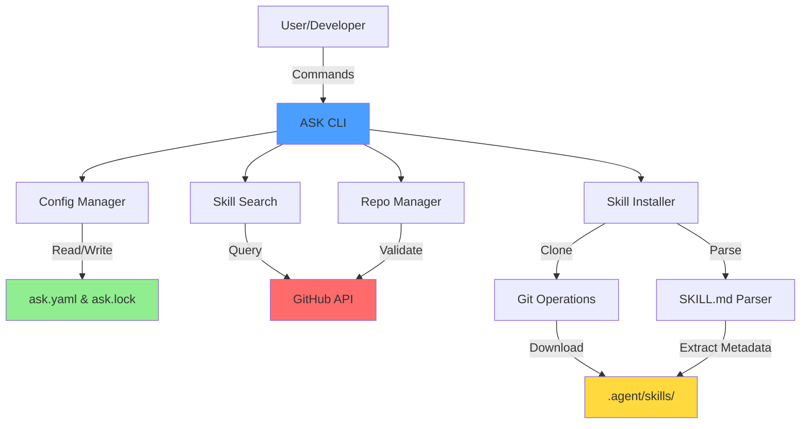

## Core Components

### 1. CLI Layer (`cmd/`)

The command layer uses [Cobra](https://github.com/spf13/cobra) for CLI framework.

**Structure**:
```
cmd/
├── root.go          # Root command & config
├── init.go          # Project initialization
├── skill.go         # Skill parent command
├── search.go        # Skill search
├── install.go       # Skill installation
├── uninstall.go     # Skill removal
├── update.go        # Skill updates
├── outdated.go      # Check outdated skills
├── list.go          # List installed skills
├── info.go          # Skill information
├── create.go        # Create skill template
├── repo.go          # Repository management
└── completion.go    # Shell completion
```

**Command Flow**:
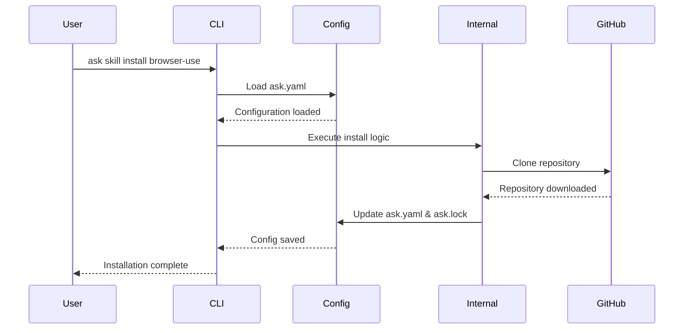

### 2. Internal Packages (`internal/`)

#### Config Management (`internal/config/`)

Handles configuration files and lock files.

**Key Files**:
- `config.go`: Main configuration logic
- `lock.go`: Version locking mechanism

**Data Structures**:
```go
type Config struct {
    Version    string
    Skills     []string
    SkillsInfo []SkillInfo
    Repos      []Repo
}

type LockFile struct {
    Version int
    Skills  []LockEntry
}
```

**Config Flow**:
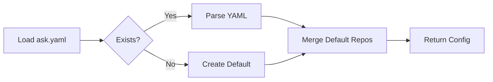

#### GitHub Integration (`internal/github/`)

Handles GitHub API interactions for skill discovery.

**Features**:
- Topic-based search (GitHub topics)
- Directory-based search (repository subdirectories)
- Result caching for performance

**API Interaction**:
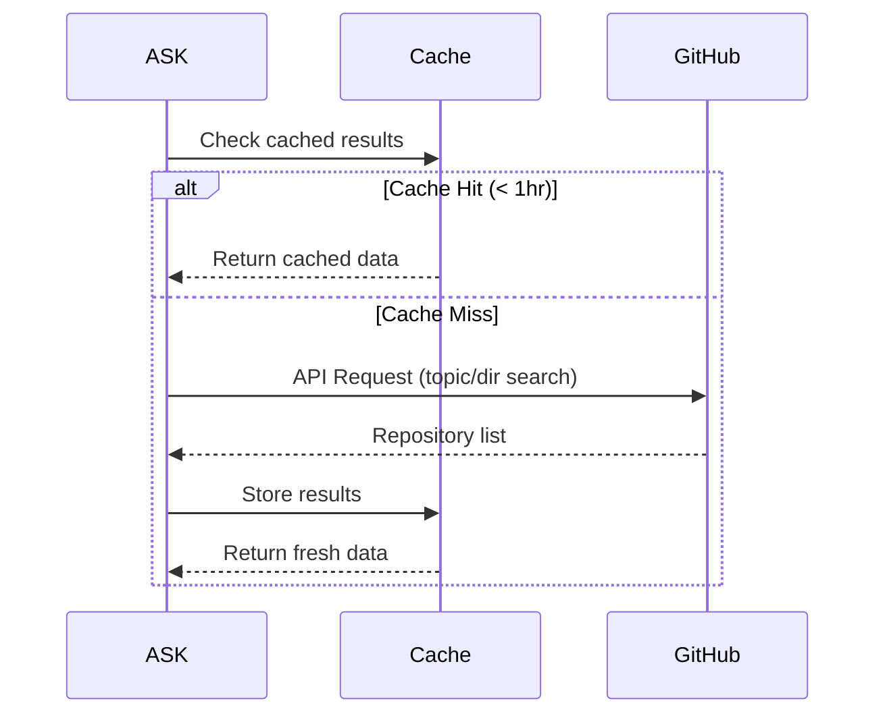

#### Git Operations (`internal/git/`)

Handles all Git-related operations.

**Key Functions**:
- `Clone()`: Standard git clone
- `SparseClone()`: Efficient subdirectory cloning
- `InstallSubdir()`: Install from repository subdirectory
- `GetLatestTag()`: Retrieve latest version tag
- `Checkout()`: Switch to specific version
- `GetCurrentCommit()`: Get commit SHA for locking

**Sparse Checkout Optimization**:
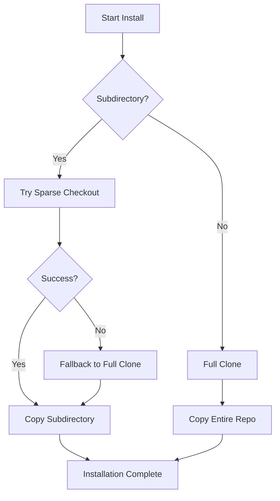

**Why Sparse Checkout?**
- **Speed**: Only downloads needed files
- **Disk Space**: Smaller footprint
- **Bandwidth**: Reduced network usage

For monorepos like `anthropics/skills`, this is 10-100x faster than full clone.

#### Skill Parsing (`internal/skill/`)

Parses `SKILL.md` files for metadata.

**SKILL.md Format**:
```yaml
---
name: browser-use
description: Browser automation for AI agents
version: 1.0.0
author: browser-use
tags:
  - browser
  - automation
dependencies:
  - playwright
---

# Browser Use

Detailed skill documentation...
```

**Parsing Flow**:
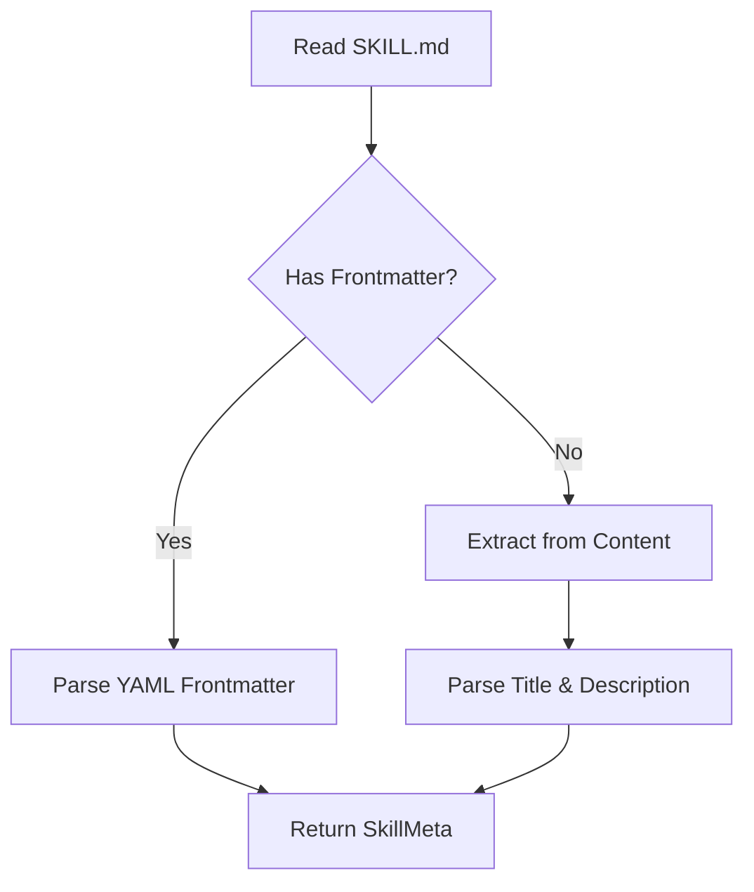

#### Dependency Resolution (`internal/deps/`)

Resolves skill dependencies in topological order.

**Dependency Graph**:
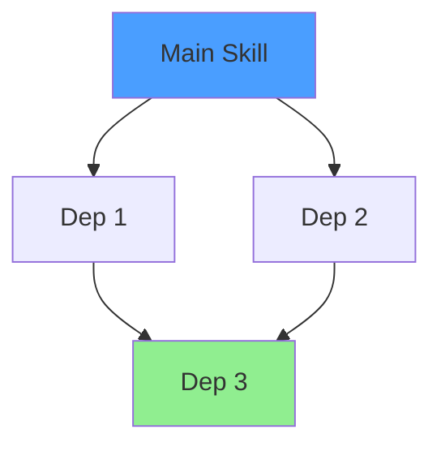

**Installation Order**: Dep 3 → Dep 1 → Dep 2 → Main Skill

**Circular Dependency Detection**:
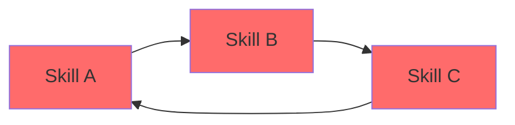

❌ This is detected and rejected to prevent infinite loops.

#### UI Components (`internal/ui/`)

Progress bars and spinners for user feedback.

**Components**:
- **Progress Bar**: For operations with known total (e.g., parallel searches)
- **Spinner**: For indeterminate operations (e.g., git clone)

#### Caching (`internal/cache/`)

Time-based caching for search results.

**Cache Strategy**:
- **TTL**: 1 hour (configurable)
- **Storage**: In-memory (could be persisted)
- **Key**: Search query hash
- **Invalidation**: Time-based expiry

## Data Flow

### Skill Installation Flow

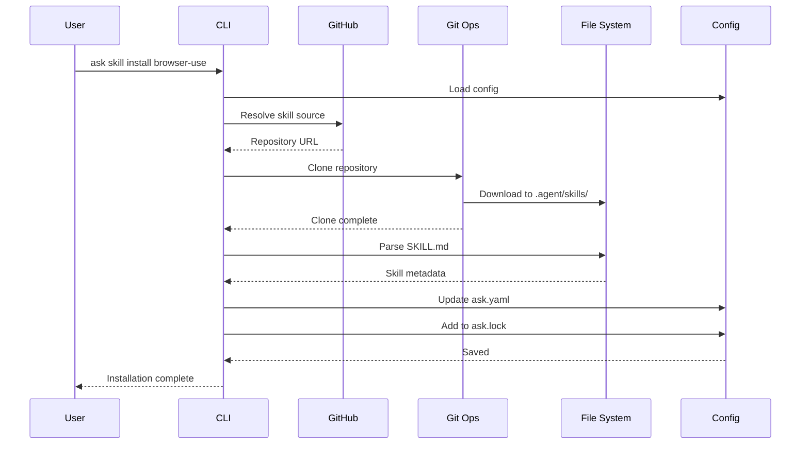

### Skill Search Flow

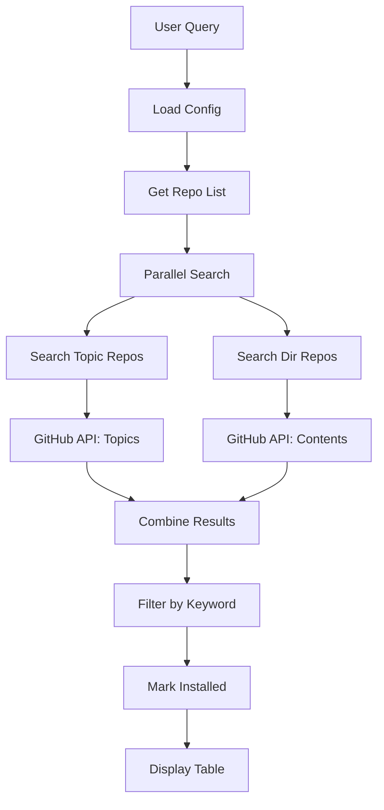

## Skill Sources

### Source Types

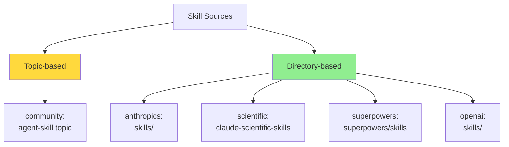

### Source Discovery

**Topic-based** (GitHub Topics API):
```
https://api.github.com/search/repositories?q=topic:agent-skill+<keyword>
```

**Directory-based** (GitHub Contents API):
```
https://api.github.com/repos/<owner>/<repo>/contents/<path>
```

## File Structure

### Project Layout

```
my-agent-project/
├── ask.yaml              # Configuration manifest
├── ask.lock              # Version lock file
├── main.py               # Your agent code
└── .agent/
    └── skills/           # Installed skills
        ├── browser-use/
        │   ├── SKILL.md
        │   ├── scripts/
        │   └── references/
        └── web-surfer/
            ├── SKILL.md
            └── ...
```

### ASK Installation

```
/usr/local/bin/
└── ask                   # Single binary (Go compiled)

~/.cache/ask/             # Optional cache directory
└── search-cache.db       # Search result cache
```

## Performance Optimizations

### 1. Parallel Search

Multiple repository sources are searched concurrently using goroutines:

```go
results := make(chan searchResult, len(repos))
for _, repo := range repos {
    go func(r Repo) {
        // Search this repo
        results <- searchRepo(r)
    }(repo)
}
```

**Performance Impact**: 5-10x faster than sequential search.

### 2. Sparse Checkout

Only download required subdirectories:

```bash
git clone --filter=blob:none --no-checkout --depth 1 <url>
git sparse-checkout init --cone
git sparse-checkout set <subdir>
git checkout
```

**Performance Impact**: 10-100x faster for monorepos.

### 3. Caching

Search results cached for 1 hour:
- Reduces GitHub API calls
- Faster repeated searches
- Prevents rate limiting

### 4. Single Binary

Go compiles to a single static binary:
- No runtime dependencies
- Fast startup time
- Easy distribution

## Security Considerations

### Trust Model

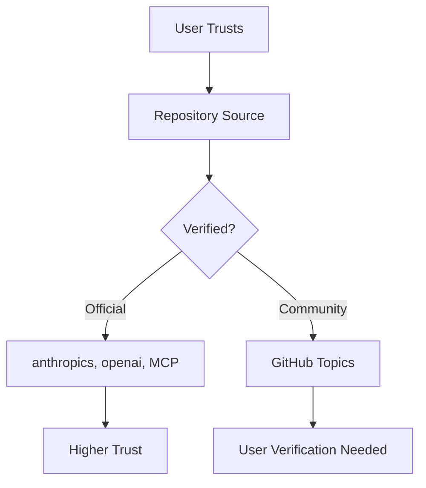

**Security Practices**:
1. **Read SKILL.md** before installation
2. **Review scripts/** directory contents
3. **Check repository stars/activity**
4. **Use version locking** for reproducibility
5. **Audit dependencies**

### Version Locking

`ask.lock` ensures reproducible installations:

```yaml
version: 1
skills:
  - name: browser-use
    url: https://github.com/browser-use/browser-use
    commit: abc123def456789...
    version: v1.2.0
    installed_at: 2026-01-15T08:00:00Z
```

This allows:
- **Exact reproduction** across environments
- **Rollback** to previous versions
- **Audit trail** of what was installed when

## Extension Points

### Custom Repositories

Users can add custom sources:

```yaml
repos:
  - name: my-team
    type: dir
    url: my-org/internal-skills/skills
```

### Future Extensibility

- **Plugin System**: Custom installers for non-Git sources
- **Registry API**: Central skill registry
- **Skill Templates**: More templates beyond default
- **Hooks**: Pre/post install hooks
- **Validation**: Skill quality checks

## Testing Strategy

### Unit Tests

Each `internal/` package has comprehensive tests:
- `config_test.go`: Config loading/saving
- `git_test.go`: Git operations
- `skill_test.go`: SKILL.md parsing
- `deps_test.go`: Dependency resolution
- `ui_test.go`: Progress bars

### Integration Tests

Command-level tests in `cmd/cmd_test.go`:
- Test command execution
- Verify help text
- Check error handling

### CI/CD

GitHub Actions workflows:
- **Lint**: golangci-lint, go fmt, go vet
- **Test**: Multi-platform (Ubuntu, macOS), multi-version (Go 1.21, 1.22)
- **Release**: Automated releases with goreleaser

## Monitoring & Observability

### Future Enhancements

- **Usage Analytics** (opt-in): Most popular skills
- **Error Reporting**: Crash reporting with consent
- **Performance Metrics**: Installation time tracking

---

## Technical Decisions

### Why Go?

1. **Single Binary**: Easy distribution
2. **Fast**: Compiled language
3. **Concurrency**: Goroutines for parallel operations
4. **Cross-platform**: Works on macOS, Linux, Windows
5. **Rich Ecosystem**: Great libraries (Cobra, progressbar)

### Why GitHub API?

1. **Ubiquitous**: Most skills already on GitHub
2. **Free tier**: Sufficient for most users
3. **Well-documented**: Stable API
4. **Version control**: Built-in versioning

### Why SKILL.md?

1. **Human-readable**: Easy to review
2. **Markdown**: Familiar format
3. **YAML frontmatter**: Structured metadata
4. **Extensible**: Can add more fields

---

## Performance Benchmarks

### Search Performance

| Repos | Sequential | Parallel | Speedup |
|-------|-----------|----------|---------|
| 1     | 1.2s      | 1.2s     | 1.0x    |
| 3     | 3.5s      | 1.4s     | 2.5x    |
| 6     | 7.1s      | 1.5s     | 4.7x    |

### Installation Performance

| Method | Time | Size |
|--------|------|------|
| Full clone (anthropics/skills) | 12.3s | 45 MB |
| Sparse checkout (single skill) | 1.1s | 2 MB |
| **Speedup** | **11x** | **22x** |

---

For more details, see:
- [Configuration Guide](configuration.md)
- [SKILL.md Format](skill-format.md)
- [Development Guide](../CONTRIBUTING.md)
