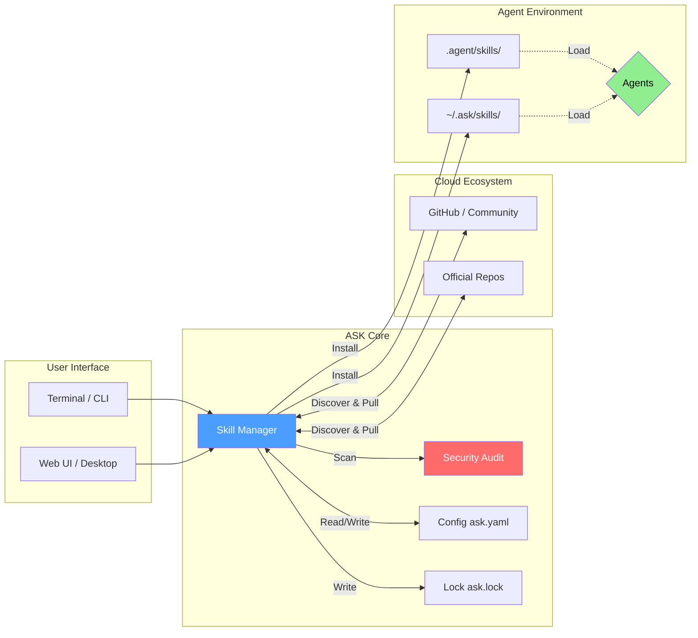
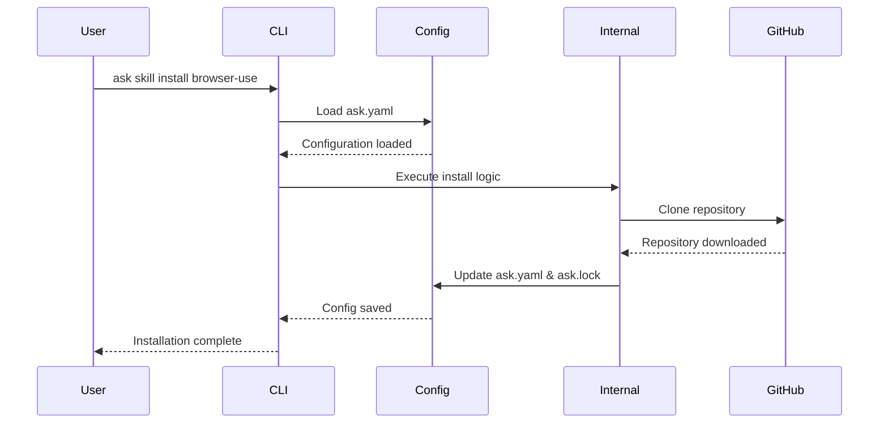
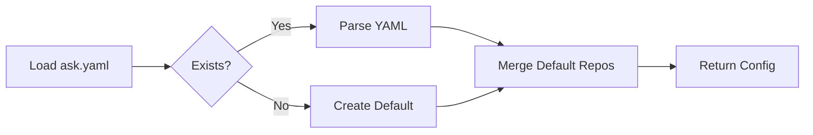
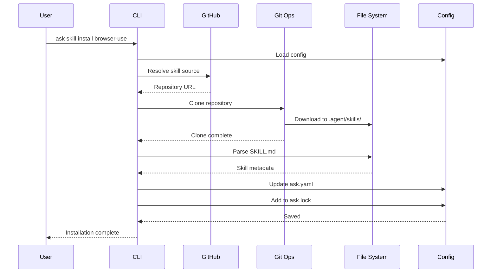
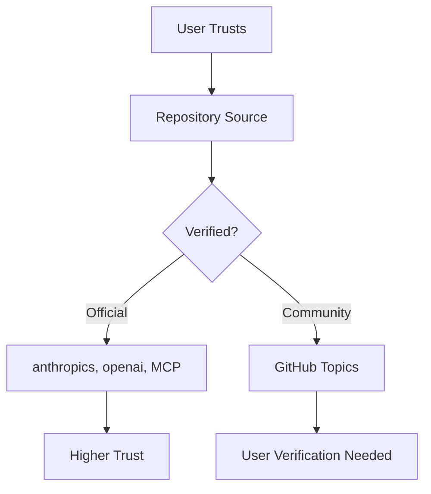

# ASK 架构设计

本文档详细描述了 ASK (Agent Skills Kit) 的技术架构。

## 系统概览

ASK 被设计为一个用 Go 语言编写的轻量级、快速的命令行工具，其管理 AI Agent 技能的方式类似于 Homebrew 或 npm 管理依赖项。



## 核心组件

### 1. CLI 层 (`cmd/`)

命令层使用 [Cobra](https://github.com/spf13/cobra) 作为 CLI 框架。

**目录结构**:
```
cmd/
├── root.go              # 根命令与配置
├── init.go              # 项目初始化
├── skill.go             # 技能父命令
├── search.go            # 技能搜索
├── install.go           # 技能安装
├── uninstall.go         # 技能卸载
├── update.go            # 技能更新
├── outdated.go          # 检查过期技能
├── list.go              # 列出已安装技能
├── info.go              # 技能详情
├── create.go            # 创建技能模板
├── repo.go              # 仓库管理
├── completion.go        # Shell 补全
├── audit.go             # 安全审计报告
├── benchmark.go         # 性能基准测试
├── check.go             # 安全扫描
├── doctor.go            # 系统诊断
├── gui.go               # 桌面应用启动
├── lock_install.go      # 锁定文件安装
├── prompt.go            # 系统提示生成
├── publish.go           # 技能发布
├── quickstart.go        # 快速入门套件
├── score.go             # 信任评分
├── serve.go             # Web UI 服务
├── service.go           # 服务管理
├── service_unix.go      # Unix 服务支持
├── service_windows.go   # Windows 服务支持
├── sync.go              # 仓库同步
├── test.go              # 技能验证测试
├── utils.go             # 共享工具函数
└── version.go           # 版本显示
```

**命令流程**:


### 2. 内部包 (`internal/`)

#### 配置管理 (`internal/config/`)

处理配置文件和锁定文件。

**关键文件**:
- `config.go`: 主配置逻辑
- `lock.go`: 版本锁定机制

**配置流程**:


#### GitHub 集成 (`internal/github/`)

处理 GitHub API 交互以进行技能发现。

**特性**:
- 基于主题的搜索 (GitHub topics)
- 基于目录的搜索 (仓库子目录)
- 结果缓存以提高性能

#### Git 操作 (`internal/git/`)

处理所有 Git 相关操作。

**关键功能**:
- `Clone()`: 标准 git clone
- `SparseClone()`: 高效的子目录克隆
- `InstallSubdir()`: 从仓库子目录安装
- `GetLatestTag()`: 获取最新版本标签
- `Checkout()`: 切换到指定版本
- `GetCurrentCommit()`: 获取 commit SHA 用于锁定

**稀疏检出优化的理由**:
- **速度**: 仅下载所需文件
- **磁盘空间**: 占用更小
- **带宽**: 减少网络使用

对于像 `anthropics/skills` 这样的 monorepo，这比完整克隆快 10-100 倍。

#### 技能解析 (`internal/skill/`)

解析 `SKILL.md` 文件以获取元数据。

**SKILL.md 格式**:
```yaml
---
name: browser-use
description: Browser automation for AI agents
version: 1.0.0
author: browser-use
tags:
  - browser
  - automation
dependencies:
  - playwright
---

# Browser Use

技能详细说明...
```

#### 依赖解析 (`internal/deps/`)

按拓扑顺序解析技能依赖。

#### UI 组件 (`internal/ui/`)

提供进度条和加载动画。

#### 缓存 (`internal/cache/`)

基于时间过期的搜索结果缓存。

- **TTL**: 1小时 (可配置)
- **存储**: 内存 (可持久化)

#### 服务器 (`internal/server/`)

用于 Web UI 和桌面应用的嵌入式 HTTP 服务器。

**结构**:
- `server.go`: 服务器生命周期和路由
- `handlers_skill.go`: 技能管理 API
- `handlers_repo.go`: 仓库管理 API
- `handlers_system.go`: 系统配置 API

#### 服务管理 (`internal/service/`)

服务器的后台进程管理。

**特性**:
- PID 文件管理
- 进程状态检查
- 服务生命周期控制

## 数据与操作生命周期

下图展示了 ASK 的完整数据与操作生命周期，包括各命令对配置文件、技能存储路径的读写操作，以及与云端数据源的交互关系。

```mermaid
flowchart TB
    %% 节点样式定义
    classDef cmdGroup fill:#e3f2fd,stroke:#1565c0,stroke-width:2px,color:#0d47a1
    classDef configNode fill:#fff9c4,stroke:#fbc02d,stroke-width:2px,color:#f57f17
    classDef storageNode fill:#e8f5e9,stroke:#2e7d32,stroke-width:2px,color:#1b5e20
    classDef cloudNode fill:#f3e5f5,stroke:#7b1fa2,stroke-width:2px,color:#4a148c
    classDef outputNode fill:#e0f7fa,stroke:#006064,stroke-width:2px,color:#006064

    %% --- 顶层：目标环境 (Agent Environment) ---
    subgraph Env [Agent 运行环境]
        direction LR
        skills_dir[".agent/skills/\n~/.ask/skills/\nAgent专用目录"]:::storageNode
        report[安全报告 HTML]:::outputNode
        template[SKILL.md 模板]:::outputNode
    end

    %% --- 底层：操作与资源来源 ---
    subgraph Sources [操作与资源层]
        direction LR
        
        %% 左下：CLI 命令
        subgraph Commands [CLI 操作入口]
            direction TB
            
            subgraph WriteCmds [修改类]
                direction TB
                install[ask skill install]
                uninstall[ask skill uninstall]
                update[ask skill update]
            end

            subgraph ReadCmds [查询类]
                direction TB
                search[ask skill search]
                list[ask skill list]
                info[ask skill info]
                outdated[ask skill outdated]
                check[ask check]
            end

            subgraph ConfigCmds [配置类]
                direction TB
                init[ask init]
                repo[ask repo add/rm]
                create[ask skill create]
            end
        end

        %% 中下：配置与缓存
        subgraph Core [配置核心]
            direction TB
            ask_yaml(ask.yaml / config.yaml):::configNode
            ask_lock(ask.lock):::configNode
            cache[(搜索缓存)]:::configNode
        end

        %% 右下：云端资源
        subgraph Cloud [云端生态]
            direction TB
            github[GitHub API]:::cloudNode
            git_repo[GitHub 仓库]:::cloudNode
        end
    end

    %% --- 连线逻辑 (自底向上) ---

    %% 1. 内部交互 (底层横向)
    %% 配置读写
    init & repo --> ask_yaml
    install & uninstall & update --> ask_yaml & ask_lock
    outdated --> ask_lock

    %% 搜索与缓存
    search <--> cache
    search <--> github
    
    %% 2. 跨层交互 (向上流动)
    %% 技能获取 (连接云端和本地)
    install & update <--> git_repo
    install & update --下载--> skills_dir
    search -.-> git_repo
    outdated -.-> git_repo

    %% 技能管理 (直接操作本地)
    uninstall --删除--> skills_dir
    list & info & check --读取--> skills_dir
    
    %% 产物生成
    check --> report
    create --> template

    %% 样式应用
    class install,uninstall,update,search,list,info,outdated,check,init,repo,create cmdGroup
```



**图例说明**：
- **深蓝 (命令)**: 位于左下，操作发起点
- **浅黄 (核心)**: 位于中下，配置与缓存层
- **浅紫 (云端)**: 位于右下，远程资源层
- **浅绿 (环境)**: 位于顶层，目标运行环境（Agent 技能目录）
- **浅蓝 (产物)**: 位于顶层，生成的文件
- **实线箭头**: 默认操作流/强依赖（自底向上）
- **虚线箭头**: 辅助信息流/弱依赖

## 数据流

### 技能安装流程



## 文件结构

### 项目布局

```
my-agent-project/
├── ask.yaml              # 项目配置
├── ask.lock              # 版本锁定文件
├── main.py               # 你的 Agent 代码
└── .agent/
    └── skills/           # 已安装技能
        ├── browser-use/
        │   ├── SKILL.md
        │   ├── scripts/
        │   └── references/
        └── web-surfer/
            ├── SKILL.md
            └── ...
```

**Agent 专属路径:**
- **Claude**: `.claude/skills/`
- **Cursor**: `.cursor/skills/`
- **Codex**: `.codex/skills/`

### ASK 安装路径

```
/usr/local/bin/
└── ask                   # 单一二进制文件 (Go 编译)

~/.cache/ask/             # 可选缓存目录
└── search-cache.db       # 搜索结果缓存
```

## 性能优化

1. **并行搜索**: 使用 goroutines 并发扫描多个来源
2. **稀疏检出**: 仅下载所需的子目录
3. **缓存**: 搜索结果缓存 1 小时
4. **单一二进制**: 无运行时依赖，启动快

## 安全考量

### 信任模型



**安全实践**:
1. 安装前阅读 `SKILL.md`
2. 审查 `scripts/` 目录内容
3. 检查仓库的 Star 数和活跃度
4. 使用版本锁定确保可复现性
5. 审计依赖项

## 扩展性

### 自定义仓库

用户可以添加自定义源：

```yaml
repos:
  - name: my-team
    type: dir
    url: my-org/internal-skills/skills
```

---

更多详细信息，请参阅：
- [配置指南](configuration_zh.md)
- [SKILL.md 格式规范](skill-format_zh.md)
- [开发指南](../CONTRIBUTING.md)
