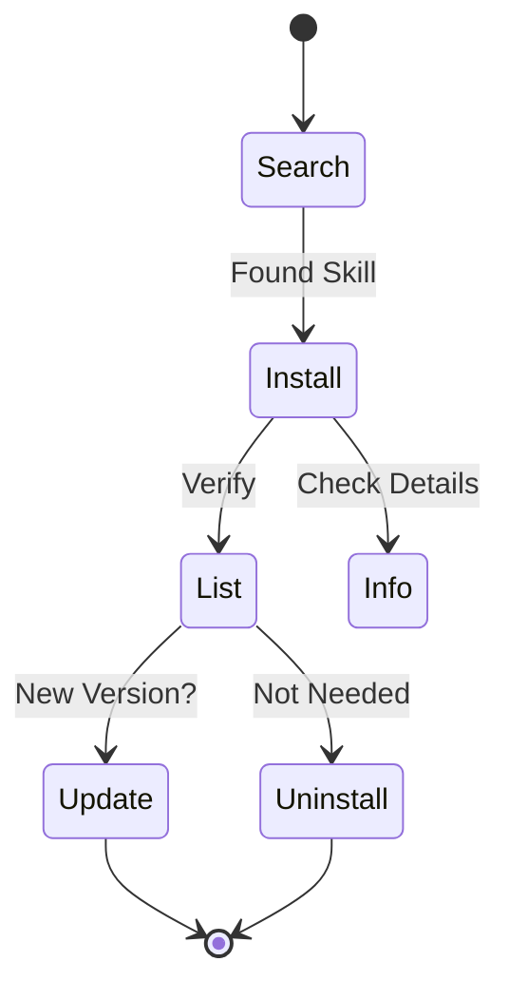

# Command Reference

Complete reference for all ASK commands.

---

## ask init

Initialize a new ASK project with interactive setup.

```bash
ask init
```

**Examples:**

```bash
ask init        # Interactive setup
ask init --yes  # Non-interactive with defaults
```

**Flags:**
- `--yes, -y`: Non-interactive mode with defaults

**What it does:**
- Walks you through selecting your AI agents (Claude, Cursor, Codex, etc.)
- Auto-detects existing agent directories in the current project
- Creates `ask.yaml` in the current directory
- Creates the `.agent/skills/` directory
- Optionally installs a starter skill pack (essentials or developer)
- In non-interactive mode (`--yes`), uses defaults and skips prompts

---

## Skill Management Commands



All skill commands are under `ask skill`:

### ask skill search

Search for skills across all configured sources.

```bash
ask skill search <keyword>
```

**Examples:**

```bash
ask skill search browser     # Find browser-related skills
ask skill search mcp         # Find MCP-related skills
ask skill search scientific  # Find scientific skills
```

**Flags:**
- `--local`: Search only local cache (offline)
- `--remote`: Force remote API search
- `--min-stars`: Filter skills by minimum number of GitHub stars
- `--json`: Output results in JSON format

**Output includes:**
- Skill name and description
- Source repository
- `[installed]` tag for skills you already have

---

### ask skill install

Install a skill to your project.

```bash
ask skill install <skill>                    # Install latest version
ask skill install <skill>@v1.0.0             # Install specific version
ask skill install owner/repo                 # Install from GitHub repo
ask skill install owner/repo/path/to/skill   # Install from subdirectory
ask skill install <skill> --agent claude,cursor  # Install for specific agents
```

**Examples:**

```bash
ask skill install browser-use              # Install by name
ask skill install browser-use@v1.2.0       # Specific version
ask skill install anthropics/skills/computer-use  # From path
```

**Flags:**
- `--agent, -a`: Install to specific agent(s) (19 agents supported, e.g., claude, cursor, codex)
- `--global, -g`: Install to global directory (~/.ask/skills)
- `--repo, -r`: Install skill(s) from a specific repository
- `--skip-score`: Skip trust score check before installing
- `--min-score`: Minimum acceptable trust grade (A/B/C/D/F, default: D)

**What it does:**
- Downloads the skill to `.agent/skills/<name>/` (or agent-specific directories)
- Adds entry to `ask.yaml`
- Records version info in `ask.lock`

---

### ask skill uninstall

Remove a skill from your project.

```bash
ask skill uninstall <skill>
```

**Flags:**
- `--agent, -a`: Target agent(s) for uninstallation
- `--global, -g`: Uninstall globally
- `--all`: Remove source and all symlinks (complete removal)

**What it does:**
- Removes `.agent/skills/<name>/` directory
- Removes entry from `ask.yaml`
- Removes entry from `ask.lock`

---

### ask skill list

List all installed skills.

```bash
ask skill list                   # List project skills
ask skill list --global          # List global skills
ask skill list --all             # List both project and global
ask skill list --agent claude    # List skills for specific agent
```

**Flags:**
- `--agent, -a`: List skills for specific agent(s)
- `--all`: Show both project and global skills
- `--global, -g`: Show global skills only
- `--json`: Output results in JSON format

---

### ask skill info

Show detailed information about a skill.

```bash
ask skill info <skill>
```

**Output includes:**
- Full description from SKILL.md
- Version information
- Dependencies
- Author and license

---

### ask skill update

Update skills to their latest versions.

```bash
ask skill update            # Update all skills
ask skill update <skill>    # Update specific skill
```

**What it does:**
- Fetches latest version from source
- Updates `ask.lock` with new commit hash

---

### ask skill outdated

Check which skills have updates available.

```bash
ask skill outdated
```

---

### ask skill create

Create a new skill from template.

```bash
ask skill create <name>
```

**What it does:**
- Creates `.agent/skills/<name>/` directory
- Generates `SKILL.md` template
- Sets up basic skill structure

---

### ask skill score

Compute a comprehensive trust score for a skill (0-100 with A/B/C/D/F grades).

```bash
ask skill score <path-or-url>
```

**Examples:**

```bash
ask skill score ./my-skill                      # Score a local skill
ask skill score ./my-skill --json               # JSON output
ask skill score anthropics/browser-use           # Score a remote skill
ask skill score --batch ./skills-dir             # Batch score all skills in a directory
ask skill score --batch anthropics/skills/skills --json  # Batch score with JSON output
```

**Flags:**
- `--json`: Output score as JSON
- `--batch`: Batch score all skills in a directory

**What it does:**
- Evaluates security via static analysis for secrets, malware, and dangerous commands
- Evaluates quality of SKILL.md metadata, README, and prompts structure
- Evaluates publisher reputation (GitHub stars, organization status)
- Checks transparency for data exfiltration patterns and obfuscated code
- Remote skills are cloned to a temp directory for analysis

---

### ask skill test

Run a comprehensive suite of validation checks on a skill.

```bash
ask skill test [skill-path]
```

**Examples:**

```bash
ask skill test             # Test skill in current directory
ask skill test ./my-skill  # Test a specific skill
```

**What it does:**
- Checks that SKILL.md exists and has valid format
- Validates required metadata fields (name, description)
- Verifies version follows semantic versioning
- Runs a security scan
- Checks for README.md
- Verifies at least one prompt or content file exists
- Reports pass/warn/fail for each check

---

### ask skill prompt

Generate an `<available_skills>` XML block for agent system prompts.

```bash
ask skill prompt [paths...]
```

**Examples:**

```bash
ask skill prompt                          # Scan all installed skills
ask skill prompt .agent/skills/pdf        # Single skill
ask skill prompt ./skills/a ./skills/b    # Multiple skills
ask skill prompt -o skills.xml            # Write to file
```

**Flags:**
- `--output, -o`: Write XML to file instead of stdout

**What it does:**
- Scans installed skills in default locations if no paths are given
- Parses SKILL.md metadata for each skill
- Generates XML following the Agent Skills specification at agentskills.io
- Output can be embedded directly in agent system prompts

---

### ask skill publish

Validate and prepare a skill for publishing to the ASK registry.

```bash
ask skill publish [skill-path]
```

**Examples:**

```bash
ask skill publish                              # Publish skill in current directory
ask skill publish ./my-skill                   # Publish skill at a specific path
ask skill publish --output registry-entry.json # Generate registry entry to file
```

**Flags:**
- `--output, -o`: Write registry entry to file

**What it does:**
- Validates SKILL.md exists and has correct format
- Runs a security scan
- Checks version follows semver
- Verifies required files (README.md, prompts/)
- Checks git repository status and tags
- Generates a registry entry for submission to awesome-agent-skills

---

## Repository Management Commands

All repository commands are under `ask repo`:

### ask repo list

List all configured skill sources, or list skills available in a specific repository.

```bash
ask repo list              # List all configured repositories
ask repo list <repo-name>  # List skills in a specific repository
```

---

### ask repo add

Add a new skill source.

```bash
ask repo add <owner/repo>
```

**Examples:**

```bash
ask repo add my-org/skills
```

**Flags:**
- `--sync`: Sync repository immediately after adding
- `--token`: Authentication token for private repositories
- `--base-url`: GitHub Enterprise API base URL
- `--private`: Mark repository as private (auto-detects gh auth token)

---

### ask repo remove

Remove a skill source.

```bash
ask repo remove <name>
```

---

### ask repo sync

Download or update skill repositories to the local cache (`~/.ask/repos/`).

```bash
ask repo sync [repo-name]
```

**Examples:**

```bash
ask repo sync              # Sync all configured repos
ask repo sync anthropics   # Sync only anthropics repo
ask repo sync openai       # Sync only openai repo
```

**What it does:**
- Clones or pulls repositories to local cache for fast offline discovery
- Syncs all configured repositories when no name is specified
- Syncs up to 5 repositories in parallel
- Fetches star counts from GitHub API for each repo
- Saves an index file with metadata for faster searches
- Eliminates GitHub API rate limits for skill discovery

---

## System Commands

### ask doctor

Diagnose and report on ASK installation health.

```bash
ask doctor
```

**Examples:**

```bash
ask doctor           # Run all health checks
ask doctor --json    # Output results in JSON format
```

**Flags:**
- `--json`: Output results in JSON format

**What it does:**
- Validates configuration files (ask.yaml, ask.lock)
- Checks skills directories and installed skills for missing SKILL.md
- Verifies repository cache status
- Checks system dependencies (git)
- Detects agent directories (Claude, Cursor, Codex, etc.)
- Reports a summary of passed, warning, and error checks

---

### ask serve

Start a local web server for visual skill management.

```bash
ask serve [path]
```

**Examples:**

```bash
ask serve              # Start server in current directory
ask serve ./my-proj    # Start server in a specific directory
ask serve --port 3000  # Use a custom port
ask serve --no-open    # Don't open browser automatically
```

**Flags:**
- `--port, -p`: Port to run the server on (default: 8125)
- `--no-open`: Don't open the browser automatically

**What it does:**
- Starts a web UI at `http://127.0.0.1:<port>`
- Provides a visual interface for viewing installed skills
- Allows searching and installing new skills from the browser
- Supports managing skill repositories
- Opens the browser automatically unless `--no-open` is set
- Gracefully shuts down on Ctrl+C

---

### ask audit

Generate a security audit report for all installed skills.

```bash
ask audit
```

**Examples:**

```bash
ask audit                                      # Console audit
ask audit --format json --output audit.json    # JSON report
ask audit --format html --output audit.html    # HTML report
ask audit --format markdown --output audit.md  # Markdown report
ask audit --global                             # Audit global skills
```

**Flags:**
- `--format`: Output format: console (default), json, html, markdown
- `--output, -o`: Write report to file
- `--global, -g`: Audit global skills instead of project skills

**What it does:**
- Scans all installed skills and runs security checks on each
- Reports findings by severity (critical, warning, info)
- Includes skill version, source, and provenance information
- Generates a summary with total counts per severity level
- Exits with code 1 if critical issues are found

---

### ask lock-install

Install skills at exact versions specified in `ask.lock` (similar to `npm ci`).

```bash
ask lock-install
```

**Examples:**

```bash
ask lock-install              # Install from project lock file
ask lock-install --global     # Install from global lock file
ask lock-install --check      # Run security check after each install
```

**Flags:**
- `--global, -g`: Install from global lock file
- `--agent, -a`: Target specific agent(s)
- `--check`: Run security check after installing each skill

**What it does:**
- Reads the lock file and installs each skill at the recorded commit/version
- Ensures reproducible installations across team members and CI/CD pipelines
- Uses commit hashes for exact version pinning when available
- Respects enterprise policy for allowed sources
- Reports per-skill success or failure with a final summary

---

### ask quickstart

Install curated collections of recommended skills.

```bash
ask quickstart [pack-name]
```

**Examples:**

```bash
ask quickstart               # List available packs
ask quickstart essentials    # Install the essentials pack
ask quickstart developer     # Install the developer pack
```

**Flags:**
- `--agent, -a`: Target specific agent(s)
- `--global, -g`: Install globally for all projects

**What it does:**
- Lists available skill packs when no pack name is given
- Installs all skills in the selected pack
- Available packs include:
  - `essentials` -- Essential skills for any agent (browser-use, pdf, filesystem)
  - `developer` -- Developer productivity skills (code-review, git-helper, testing)

---

### ask version

Show the current version of ASK.

```bash
ask version
```

---

## Utilities

### ask benchmark

Run performance benchmarks to measure CLI speed.

```bash
ask benchmark
```

**What it does:**
- Measures cold and hot search performance
- Measures config load time
- Helps diagnose performance issues

---

### ask completion

Generate shell completion scripts.

```bash
ask completion [bash|zsh|fish|powershell]
```


---

### ask skill check

Check a skill for security issues.

```bash
ask skill check <skill-path>      # Check local skill
ask skill check .                 # Check current directory
ask skill check -o report.html    # Generate HTML report
ask skill check -o report.sarif   # Generate SARIF report
```

**Flags:**
- `--output, -o`: Save detailed findings to a file (`.md`, `.html`, `.json`, `.sarif`)
- `--format`: Output format for console (console, json, html, markdown, sarif)
- `--ci`: CI mode — exit non-zero on findings above severity threshold
- `--severity`: Minimum severity to report (info, warning, critical) (default: warning)
- `--watch`: Watch mode — re-check on file changes

**What it does:**
- Scans for hardcoded secrets (API keys, tokens)
- Detects dangerous commands (`rm -rf`, `sudo`, reverse shells)
- Flags suspicious file extensions (`.exe`, `.dll`, etc.)
- Calculates entropy to reduce false positives

---

## Global Flags

### --offline

Run specific commands in offline mode.

```bash
ask skill search <keyword> --offline
ask skill outdated --offline
```

**What it does:**
- Disables all network requests
- Forces usage of local cache for search
- Skips remote checks for updates
- Useful for air-gapped environments or low connectivity
