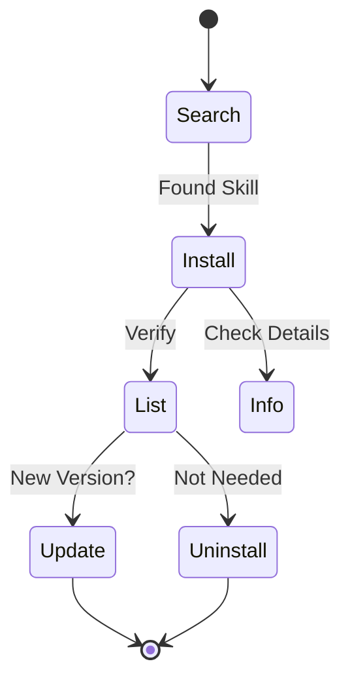

# Command Reference

Complete reference for all ASK commands.

---

## ask init

Initialize ASK in your project directory.

```bash
ask init
```

**What it does:**
- Creates `ask.yaml` in current directory
- Sets up default skill sources
- Prepares your project for skill management

---

## Skill Management Commands



All skill commands are under `ask skill`:

### ask skill search

Search for skills across all configured sources.

```bash
ask skill search <keyword>
```

**Examples:**

```bash
ask skill search browser     # Find browser-related skills
ask skill search mcp         # Find MCP-related skills
ask skill search scientific  # Find scientific skills
```

**Output includes:**
- Skill name and description
- Source repository
- `[installed]` tag for skills you already have

---

### ask skill install

Install a skill to your project.

```bash
ask skill install <skill>                    # Install latest version
ask skill install <skill>@v1.0.0             # Install specific version
ask skill install owner/repo                 # Install from GitHub repo
ask skill install owner/repo/path/to/skill   # Install from subdirectory
```

**Examples:**

```bash
ask skill install browser-use              # Install by name
ask skill install browser-use@v1.2.0       # Specific version
ask skill install anthropics/skills/computer-use  # From path
```

**What it does:**
- Downloads the skill to `.agent/skills/<name>/`
- Adds entry to `ask.yaml`
- Records version info in `ask.lock`

---

### ask skill uninstall

Remove a skill from your project.

```bash
ask skill uninstall <skill>
```

**What it does:**
- Removes `.agent/skills/<name>/` directory
- Removes entry from `ask.yaml`
- Removes entry from `ask.lock`

---

### ask skill list

List all installed skills.

```bash
ask skill list
```

---

### ask skill info

Show detailed information about a skill.

```bash
ask skill info <skill>
```

**Output includes:**
- Full description from SKILL.md
- Version information
- Dependencies
- Author and license

---

### ask skill update

Update skills to their latest versions.

```bash
ask skill update            # Update all skills
ask skill update <skill>    # Update specific skill
```

**What it does:**
- Fetches latest version from source
- Updates `ask.lock` with new commit hash

---

### ask skill outdated

Check which skills have updates available.

```bash
ask skill outdated
```

---

### ask skill create

Create a new skill from template.

```bash
ask skill create <name>
```

**What it does:**
- Creates `.agent/skills/<name>/` directory
- Generates `SKILL.md` template
- Sets up basic skill structure

---

## Repository Management Commands

All repository commands are under `ask repo`:

### ask repo list

List all configured skill sources, or list skills available in a specific repository.

```bash
ask repo list              # List all configured repositories
ask repo list <repo-name>  # List skills in a specific repository
```

---

### ask repo add

Add a new skill source.

```bash
ask repo add <owner/repo>
```

**Examples:**

```bash
ask repo add my-org/skills
```

---

### ask repo remove

Remove a skill source.

ask repo remove <name>
```

---

## Utilities

### ask benchmark

Run performance benchmarks to measure CLI speed.

```bash
ask benchmark
```

**What it does:**
- Measures cold and hot search performance
- Measures config load time
- Helps diagnose performance issues

---

### ask completion

Generate shell completion scripts.

```bash
ask completion [bash|zsh|fish|powershell]
```

---

## Global Flags

### --offline

Run specific commands in offline mode.

```bash
ask skill search <keyword> --offline
ask skill outdated --offline
```

**What it does:**
- Disables all network requests
- Forces usage of local cache for search
- Skips remote checks for updates
- Useful for air-gapped environments or low connectivity
