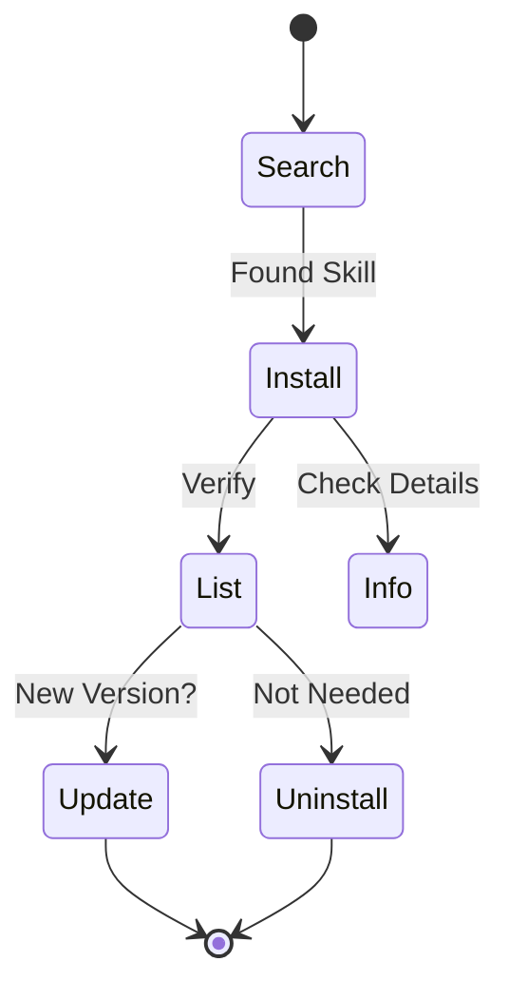

# 命令参考

所有 ASK 命令的完整参考手册。

---

## ask init

初始化一个新的 ASK 项目，支持交互式设置。

```bash
ask init
```

**示例：**

```bash
ask init        # 交互式设置
ask init --yes  # 非交互式，使用默认值
```

**参数：**
- `--yes, -y`: 非交互式模式，使用默认值

**功能说明：**
- 引导您选择 AI Agent（Claude、Cursor、Codex 等）
- 自动检测当前项目中已有的 Agent 目录
- 在当前目录创建 `ask.yaml`
- 创建 `.agent/skills/` 目录
- 可选安装入门技能包（essentials 或 developer）
- 非交互式模式（`--yes`）下使用默认值并跳过提示

---

## 技能管理命令



所有技能相关的命令都在 `ask skill` 下：

### ask skill search

在所有配置的源中搜索技能。

```bash
ask skill search <keyword>
```

**示例：**

```bash
ask skill search browser     # 查找与浏览器相关的技能
ask skill search mcp         # 查找与 MCP 相关的技能
ask skill search scientific  # 查找科学计算类技能
```

**参数：**
- `--local`: 仅搜索本地缓存（离线模式）
- `--remote`: 强制使用远程 API 搜索
- `--min-stars`: 按 GitHub 最低星标数筛选技能
- `--json`: 以 JSON 格式输出结果

**输出包含：**
- 技能名称和描述
- 来源仓库
- 已安装技能会标记 `[installed]`

---

### ask skill install

安装技能到您的项目中。

```bash
ask skill install <skill>                    # 安装最新版本
ask skill install <skill>@v1.0.0             # 安装特定版本
ask skill install owner/repo                 # 从 GitHub 仓库安装
ask skill install owner/repo/path/to/skill   # 从子目录安装
ask skill install <skill> --agent claude,cursor  # 为特定 Agent 安装
```

**示例：**

```bash
ask skill install browser-use              # 按名称安装
ask skill install browser-use@v1.2.0       # 指定版本
ask skill install anthropics/skills/computer-use  # 指定路径
```

**参数：**
- `--agent, -a`: 安装到特定的 Agent（支持 19 种，如 claude, cursor, codex）
- `--global, -g`: 安装到全局目录 (~/.ask/skills)
- `--repo, -r`: 从指定仓库安装技能
- `--skip-score`: 跳过安装前的信任评分检查
- `--min-score`: 最低可接受的信任等级（A/B/C/D/F，默认: D）

**功能说明：**
- 下载技能到 `.agent/skills/<name>/` (或 Agent 特定目录)
- 添加条目到 `ask.yaml`
- 在 `ask.lock` 中记录版本信息

---

### ask skill uninstall

从您的项目中移除技能。

```bash
ask skill uninstall <skill>
```

**参数：**
- `--agent, -a`: 卸载的目标 Agent
- `--global, -g`: 全局卸载
- `--all`: 移除源文件和所有符号链接（完全移除）

**功能说明：**
- 删除 `.agent/skills/<name>/` 目录
- 从 `ask.yaml` 中移除条目
- 从 `ask.lock` 中移除条目

---

### ask skill list

列出所有已安装的技能。

```bash
ask skill list                   # 列出项目技能
ask skill list --global          # 列出全局技能
ask skill list --all             # 列出项目和全局技能
ask skill list --agent claude    # 列出特定 Agent 的技能
```

**参数：**
- `--agent, -a`: 列出特定 Agent 的技能
- `--all`: 显示项目和全局技能
- `--global, -g`: 仅显示全局技能
- `--json`: 以 JSON 格式输出结果

---

### ask skill info

显示技能的详细信息。

```bash
ask skill info <skill>
```

**输出包含：**
- 来自 SKILL.md 的完整描述
- 版本信息
- 依赖项
- 作者和许可证

---

### ask skill update

将技能更新到最新版本。

```bash
ask skill update            # 更新所有技能
ask skill update <skill>    # 更新特定技能
```

**功能说明：**
- 从源获取最新版本
- 更新 `ask.lock` 中的提交哈希

---

### ask skill outdated

检查哪些技能有可用更新。

```bash
ask skill outdated
```

---

### ask skill create

从模板创建一个新技能。

```bash
ask skill create <name>
```

**功能说明：**
- 创建 `.agent/skills/<name>/` 目录
- 生成 `SKILL.md` 模板
- 设置基本的技能结构

---

### ask skill score

计算技能的综合信任评分（0-100，等级为 A/B/C/D/F）。

```bash
ask skill score <path-or-url>
```

**示例：**

```bash
ask skill score ./my-skill                      # 评分本地技能
ask skill score ./my-skill --json               # JSON 输出
ask skill score anthropics/browser-use           # 评分远程技能
ask skill score --batch ./skills-dir             # 批量评分目录中所有技能
ask skill score --batch anthropics/skills/skills --json  # 批量评分并输出 JSON
```

**参数：**
- `--json`: 以 JSON 格式输出评分
- `--batch`: 批量评分目录中所有技能

**功能说明：**
- 通过静态分析评估安全性，检测密钥、恶意软件和危险命令
- 评估 SKILL.md 元数据、README 和提示结构的质量
- 评估发布者信誉（GitHub 星标数、组织状态）
- 检查数据泄露模式和混淆代码的透明度
- 远程技能会被克隆到临时目录进行分析

---

### ask skill test

对技能运行全面的验证检查套件。

```bash
ask skill test [skill-path]
```

**示例：**

```bash
ask skill test             # 测试当前目录中的技能
ask skill test ./my-skill  # 测试特定技能
```

**功能说明：**
- 检查 SKILL.md 是否存在且格式有效
- 验证必需的元数据字段（名称、描述）
- 验证版本是否遵循语义化版本规范
- 运行安全扫描
- 检查是否存在 README.md
- 验证至少存在一个提示或内容文件
- 为每项检查报告通过/警告/失败状态

---

### ask skill prompt

为 Agent 系统提示生成 `<available_skills>` XML 块。

```bash
ask skill prompt [paths...]
```

**示例：**

```bash
ask skill prompt                          # 扫描所有已安装技能
ask skill prompt .agent/skills/pdf        # 单个技能
ask skill prompt ./skills/a ./skills/b    # 多个技能
ask skill prompt -o skills.xml            # 写入文件
```

**参数：**
- `--output, -o`: 将 XML 写入文件而非标准输出

**功能说明：**
- 未指定路径时扫描默认位置中已安装的技能
- 解析每个技能的 SKILL.md 元数据
- 按照 agentskills.io 的 Agent Skills 规范生成 XML
- 输出可直接嵌入 Agent 系统提示中

---

### ask skill publish

验证并准备技能以发布到 ASK 注册中心。

```bash
ask skill publish [skill-path]
```

**示例：**

```bash
ask skill publish                              # 发布当前目录的技能
ask skill publish ./my-skill                   # 发布指定路径的技能
ask skill publish --output registry-entry.json # 将注册中心条目生成到文件
```

**参数：**
- `--output, -o`: 将注册中心条目写入文件

**功能说明：**
- 验证 SKILL.md 是否存在且格式正确
- 运行安全扫描
- 检查版本是否遵循语义化版本规范
- 验证必需文件（README.md、prompts/）
- 检查 Git 仓库状态和标签
- 生成注册中心条目以提交到 awesome-agent-skills

---

## 仓库管理命令

所有仓库相关的命令都在 `ask repo` 下：

### ask repo list

列出所有配置的技能源，或列出特定仓库中可用的技能。

```bash
ask repo list              # 列出所有配置的仓库
ask repo list <repo-name>  # 列出特定仓库中的技能
```

---

### ask repo add

添加一个新的技能源。

```bash
ask repo add <owner/repo>
```

**示例：**

```bash
ask repo add my-org/skills
```

**参数：**
- `--sync`: 添加后立即同步仓库
- `--token`: 私有仓库的认证令牌
- `--base-url`: GitHub Enterprise API 基础 URL
- `--private`: 标记仓库为私有（自动检测 gh auth 令牌）

---

### ask repo remove

移除一个技能源。

```bash
ask repo remove <name>
```

---

### ask repo sync

下载或更新技能仓库到本地缓存（`~/.ask/repos/`）。

```bash
ask repo sync [repo-name]
```

**示例：**

```bash
ask repo sync              # 同步所有配置的仓库
ask repo sync anthropics   # 仅同步 anthropics 仓库
ask repo sync openai       # 仅同步 openai 仓库
```

**功能说明：**
- 将仓库克隆或拉取到本地缓存，以实现快速离线发现
- 未指定名称时同步所有配置的仓库
- 最多并行同步 5 个仓库
- 从 GitHub API 获取每个仓库的星标数
- 保存索引文件及元数据以加速搜索
- 消除技能发现过程中的 GitHub API 速率限制

---

## 系统命令

### ask doctor

诊断并报告 ASK 安装的健康状况。

```bash
ask doctor
```

**示例：**

```bash
ask doctor           # 运行所有健康检查
ask doctor --json    # 以 JSON 格式输出结果
```

**参数：**
- `--json`: 以 JSON 格式输出结果

**功能说明：**
- 验证配置文件（ask.yaml、ask.lock）
- 检查技能目录和已安装技能是否缺少 SKILL.md
- 验证仓库缓存状态
- 检查系统依赖项（git）
- 检测 Agent 目录（Claude、Cursor、Codex 等）
- 报告通过、警告和错误检查的汇总

---

### ask serve

启动本地 Web 服务器以进行可视化技能管理。

```bash
ask serve [path]
```

**示例：**

```bash
ask serve              # 在当前目录启动服务器
ask serve ./my-proj    # 在指定目录启动服务器
ask serve --port 3000  # 使用自定义端口
ask serve --no-open    # 不自动打开浏览器
```

**参数：**
- `--port, -p`: 服务器运行端口（默认：8125）
- `--no-open`: 不自动打开浏览器

**功能说明：**
- 在 `http://127.0.0.1:<port>` 启动 Web 界面
- 提供可视化界面查看已安装的技能
- 允许从浏览器搜索和安装新技能
- 支持管理技能仓库
- 除非设置了 `--no-open`，否则自动打开浏览器
- 按 Ctrl+C 优雅关闭

---

### ask audit

为所有已安装的技能生成安全审计报告。

```bash
ask audit
```

**示例：**

```bash
ask audit                                      # 控制台审计
ask audit --format json --output audit.json    # JSON 报告
ask audit --format html --output audit.html    # HTML 报告
ask audit --format markdown --output audit.md  # Markdown 报告
ask audit --global                             # 审计全局技能
```

**参数：**
- `--format`: 输出格式：console（默认）、json、html、markdown
- `--output, -o`: 将报告写入文件
- `--global, -g`: 审计全局技能而非项目技能

**功能说明：**
- 扫描所有已安装的技能并对每个技能运行安全检查
- 按严重程度报告发现（critical、warning、info）
- 包含技能版本、来源和出处信息
- 生成每个严重程度级别的汇总统计
- 如果发现严重问题，退出码为 1

---

### ask lock-install

按照 `ask.lock` 中指定的确切版本安装技能（类似于 `npm ci`）。

```bash
ask lock-install
```

**示例：**

```bash
ask lock-install              # 从项目锁定文件安装
ask lock-install --global     # 从全局锁定文件安装
ask lock-install --check      # 每次安装后运行安全检查
```

**参数：**
- `--global, -g`: 从全局锁定文件安装
- `--agent, -a`: 针对特定的 Agent
- `--check`: 每次安装技能后运行安全检查

**功能说明：**
- 读取锁定文件并按照记录的提交/版本安装每个技能
- 确保团队成员和 CI/CD 流水线之间的可重现安装
- 可用时使用提交哈希进行精确版本固定
- 遵守企业策略中的允许源列表
- 为每个技能报告成功或失败，并提供最终汇总

---

### ask quickstart

安装精选的推荐技能集合。

```bash
ask quickstart [pack-name]
```

**示例：**

```bash
ask quickstart               # 列出可用的技能包
ask quickstart essentials    # 安装 essentials 技能包
ask quickstart developer     # 安装 developer 技能包
```

**参数：**
- `--agent, -a`: 针对特定的 Agent
- `--global, -g`: 全局安装，适用于所有项目

**功能说明：**
- 未指定技能包名称时列出可用的技能包
- 安装所选技能包中的所有技能
- 可用的技能包包括：
  - `essentials` -- 适用于任何 Agent 的基础技能（browser-use、pdf、filesystem）
  - `developer` -- 开发者生产力技能（code-review、git-helper、testing）

---

### ask version

显示 ASK 的当前版本。

```bash
ask version
```

---

## 实用工具

### ask benchmark

运行性能基准测试以测量 CLI 速度。

```bash
ask benchmark
```

**功能说明：**
- 测量冷启动和热启动搜索性能
- 测量配置加载时间
- 帮助诊断性能问题

---

### ask completion

生成 Shell 补全脚本。

```bash
ask completion [bash|zsh|fish|powershell]
```

---

### ask skill check

检查技能的安全性问题。

```bash
ask skill check <skill-path>      # 检查本地技能
ask skill check .                 # 检查当前目录
ask skill check -o report.html    # 生成 HTML 报告
ask skill check -o report.sarif   # 生成 SARIF 报告
```

**参数：**
- `--output, -o`: 将详细结果保存到文件 (`.md`, `.html`, `.json`, `.sarif`)
- `--format`: 控制台输出格式（console, json, html, markdown, sarif）
- `--ci`: CI 模式 — 当发现超过严重性阈值的问题时以非零状态退出
- `--severity`: 报告的最低严重性级别（info, warning, critical）（默认: warning）
- `--watch`: 监视模式 — 文件变更时重新检查

**功能说明：**
- 扫描硬编码的密钥 (API 密钥, 令牌)
- 检查危险命令 (如 `rm -rf`, `sudo`, 反向 Shell)
- 标记可疑的文件扩展名 (`.exe`, `.dll` 等)
- 计算熵值以减少误报

---

## 全局参数

### --offline

在离线模式下运行特定命令。

```bash
ask skill search <keyword> --offline
ask skill outdated --offline
```

**功能说明：**
- 禁用所有网络请求
- 强制使用本地缓存进行搜索
- 跳过远程更新检查
- 适用于气隙环境或低连接性的环境
