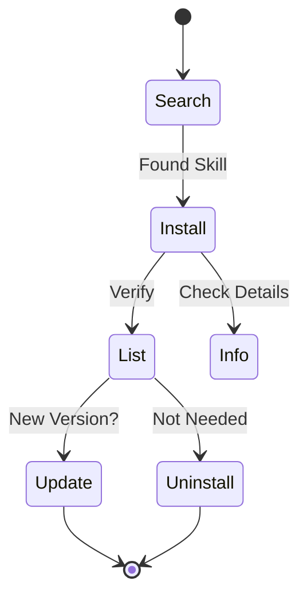

# 命令参考

所有 ASK 命令的完整参考手册。

---

## ask init

在您的项目目录中初始化 ASK。

```bash
ask init
```

**功能说明：**
- 在当前目录创建 `ask.yaml`
- 设置默认的技能源
- 为您的项目准备技能管理环境

---

## 技能管理命令



所有技能相关的命令都在 `ask skill` 下：

### ask skill search

在所有配置的源中搜索技能。

```bash
ask skill search <keyword>
```

**示例：**

```bash
ask skill search browser     # 查找与浏览器相关的技能
ask skill search mcp         # 查找与 MCP 相关的技能
ask skill search scientific  # 查找科学计算类技能
```

**输出包含：**
- 技能名称和描述
- 来源仓库
- 已安装技能会标记 `[installed]`

---

### ask skill install

安装技能到您的项目中。

```bash
ask skill install <skill>                    # 安装最新版本
ask skill install <skill>@v1.0.0             # 安装特定版本
ask skill install owner/repo                 # 从 GitHub 仓库安装
ask skill install owner/repo/path/to/skill   # 从子目录安装
ask skill install <skill> --agent claude cursor  # 为特定 Agent 安装
```

**示例：**

```bash
ask skill install browser-use              # 按名称安装
ask skill install browser-use@v1.2.0       # 指定版本
ask skill install anthropics/skills/computer-use  # 指定路径
```

**参数：**
- `--agent, -a`: 安装到特定的 Agent (claude, cursor, codex, opencode)
- `--global, -g`: 安装到全局目录 (~/.ask/skills)

**功能说明：**
- 下载技能到 `.agent/skills/<name>/` (或 Agent 特定目录)
- 添加条目到 `ask.yaml`
- 在 `ask.lock` 中记录版本信息

---

### ask skill uninstall

从您的项目中移除技能。

```bash
ask skill uninstall <skill>
```

**功能说明：**
- 删除 `.agent/skills/<name>/` 目录
- 从 `ask.yaml` 中移除条目
- 从 `ask.lock` 中移除条目

---

### ask skill list

列出所有已安装的技能。

```bash
ask skill list                   # 列出项目技能
ask skill list --global          # 列出全局技能
ask skill list --all             # 列出项目和全局技能
ask skill list --agent claude    # 列出特定 Agent 的技能
```

**参数：**
- `--agent, -a`: 列出特定 Agent 的技能
- `--all`: 显示项目和全局技能
- `--global, -g`: 仅显示全局技能

---

### ask skill info

显示技能的详细信息。

```bash
ask skill info <skill>
```

**输出包含：**
- 来自 SKILL.md 的完整描述
- 版本信息
- 依赖项
- 作者和许可证

---

### ask skill update

将技能更新到最新版本。

```bash
ask skill update            # 更新所有技能
ask skill update <skill>    # 更新特定技能
```

**功能说明：**
- 从源获取最新版本
- 更新 `ask.lock` 中的提交哈希

---

### ask skill outdated

检查哪些技能有可用更新。

```bash
ask skill outdated
```

---

### ask skill create

从模板创建一个新技能。

```bash
ask skill create <name>
```

**功能说明：**
- 创建 `.agent/skills/<name>/` 目录
- 生成 `SKILL.md` 模板
- 设置基本的技能结构

---

## 仓库管理命令

所有仓库相关的命令都在 `ask repo` 下：

### ask repo list

列出所有配置的技能源，或列出特定仓库中可用的技能。

```bash
ask repo list              # 列出所有配置的仓库
ask repo list <repo-name>  # 列出特定仓库中的技能
```

---

### ask repo add

添加一个新的技能源。

```bash
ask repo add <owner/repo>
```

**示例：**

```bash
ask repo add my-org/skills
```

---

### ask repo remove

移除一个技能源。

```bash
ask repo remove <name>
```

---

## 实用工具

### ask benchmark

运行性能基准测试以测量 CLI 速度。

```bash
ask benchmark
```

**功能说明：**
- 测量冷启动和热启动搜索性能
- 测量配置加载时间
- 帮助诊断性能问题

---

### ask completion

生成 Shell 补全脚本。

```bash
ask completion [bash|zsh|fish|powershell]
```

---

### ask skill check

检查技能的安全性问题。

```bash
ask skill check <skill-path>      # 检查本地技能
ask skill check .                 # 检查当前目录
ask skill check -o report.html    # 生成 HTML 报告
ask skill check -o report.json    # 生成 JSON 报告
```

**参数：**
- `--output, -o`: 将详细结果保存到文件 (`.md`, `.html`, `.json`)。

**功能说明：**
- 扫描硬编码的密钥 (API 密钥, 令牌)
- 检查危险命令 (如 `rm -rf`, `sudo`, 反向 Shell)
- 标记可疑的文件扩展名 (`.exe`, `.dll` 等)
- 计算熵值以减少误报

---

## 全局参数

### --offline

在离线模式下运行特定命令。

```bash
ask skill search <keyword> --offline
ask skill outdated --offline
```

**功能说明：**
- 禁用所有网络请求
- 强制使用本地缓存进行搜索
- 跳过远程更新检查
- 适用于气隙环境或低连接性的环境
