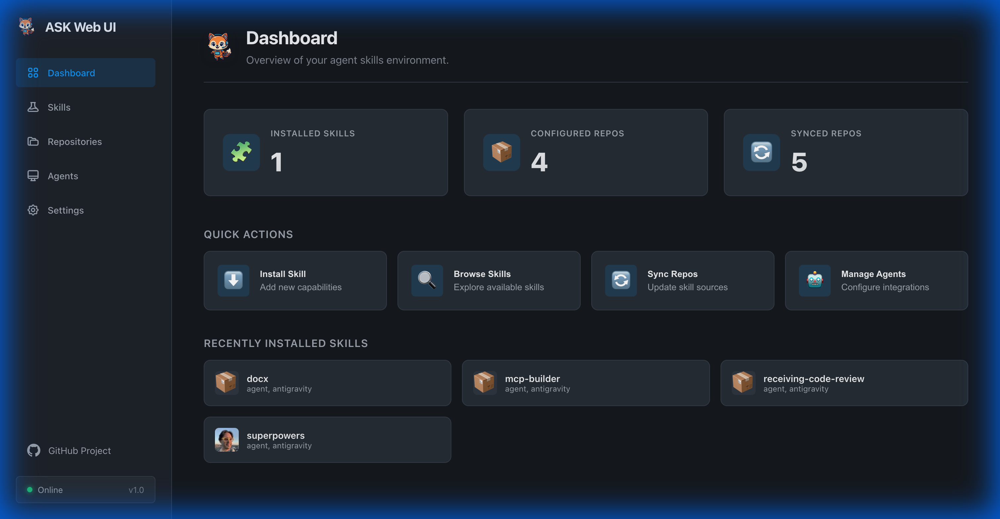

# ASK Web UI

The ASK Web UI provides a modern, visual interface for managing your agent skills and repositories. It allows you to discover, install, uninstall, and configure skills with ease.



## Getting Started

To launch the Web UI, run the following command in your project directory:

```bash
ask serve
```

This will start the local server, usually at `http://127.0.0.1:8125`.

## Features

### 1. Dashboard
The dashboard gives you a quick overview of your ASK environment:
- **Total Skills**: Number of available skills across all repositories.
- **Installed Skills**: Number of skills installed in your current project.
- **Repositories**: Number of configured skill sources.
- **Agents**: Detected agents in your project (e.g., Claude, Cursor).

### 2. Skills Management
Navigate to the **Skills** page to browse and manage skills.


- **Search**: detailed search across name, description, and keywords.
- **Install**: One-click installation for any skill.
- **Uninstall**: Remove skills with a confirmation dialog to prevent accidental deletion.
- **Icons**: Smart emoji icons help you quickly identify skill types (e.g., 🐙 for Git, 🐍 for Python).

### 3. Repository Management
Manage your skill sources in the **Repositories** page.


- View all configured repositories and their status.
- Add new repositories by URL.
- Sync repositories to get the latest skills.
- Full GitHub URL support for verification.

### 4. Configuration
Configure your ASK environment in the **Settings** page.


- **Project Root**: Set and save your project root directory.
- **Theme**: Toggle between Light and Dark modes.
- **Reset**: Reset web preferences if needed.
