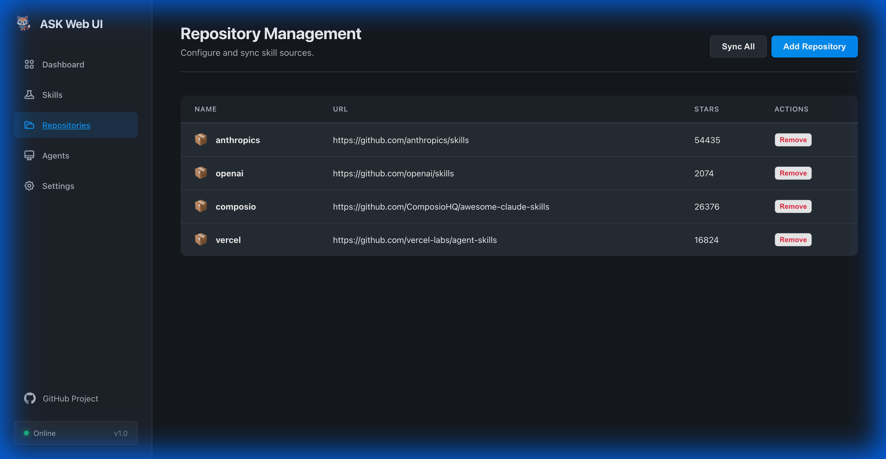
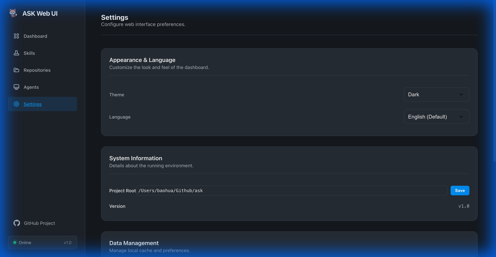

# ASK Web 界面和桌面应用

ASK Web UI 提供了一个现代化的可视化界面，用于管理您的智能体技能和仓库。它允许您轻松地发现、安装、卸载和配置技能。

它可以作为 **Web 服务器** 运行，也可以使用 [Wails](https://wails.io) 构建为 **原生桌面应用程序**。


## 快速开始

### Web 服务器
```bash
ask serve
```
这将在 `http://127.0.0.1:8125` 启动本地服务器。

### 桌面应用
```bash
# 首先安装 Wails CLI
go install github.com/wailsapp/wails/v2/cmd/wails@latest

# 构建并运行
wails build
./build/bin/ask-desktop
```

或者从 [Releases](https://github.com/yeasy/ask/releases) 下载预构建的桌面应用。

## 功能特性

### 1. 仪表板
仪表板为您提供 ASK 环境的快速概览：
- **全部技能**：所有仓库中可用技能的总数。
- **已安装技能**：当前项目中已安装的技能数量。
- **仓库**：已配置的技能源数量。
- **智能体**：项目中检测到的智能体（例如 Claude, Cursor）。

### 2. 技能管理
导航至 **Skills** 页面浏览和管理技能。


- **搜索**：跨名称、描述和关键字的详细搜索。
- **安装**：一键安装任何技能。
- **卸载**：带有确认对话框的技能移除，防止误删。
- **图标**：智能 Emoji 图标帮助您快速识别技能类型（例如 🐙 代表 Git，🐍 代表 Python）。

### 3. 仓库管理
在 **Repositories** 页面管理您的技能源。



- 查看所有已配置的仓库及其状态。
- 通过 URL 添加新仓库。
- 同步仓库以获取最新技能。
- 完整的 GitHub URL 支持（用于验证）。

### 4. 配置
在 **Settings** 页面配置您的 ASK 环境。



- **项目根目录**：设置并保存您的项目根目录。
- **主题**：在明亮和黑暗模式之间切换。
- **重置**：如果需要，重置 Web 首选项。
